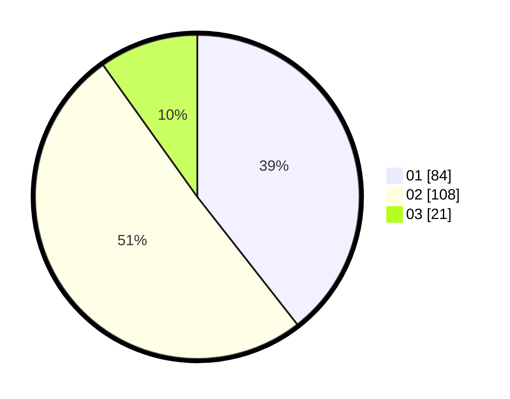

# Hasil

Hasil perolehan suara paslon dapat dilihat pada file paslon-01.txt, paslon-02.txt, dan paslon-03.txt.

Jika tidak ada, artinya data tersebut belum ada pada SIREKAP.

## Perolehan Suara

 * Paslon 01: **84**.
 * Paslon 02: **108**.
 * Paslon 03: **21**.

## Foto C Plano

https://sirekap-obj-formc.kpu.go.id/c440/pemilu/ppwp/31/73/07/10/01/3173071001033-20240214-224623--ac9dedfa-491a-4efb-9a93-abebd720d7ae.jpg

https://sirekap-obj-formc.kpu.go.id/c440/pemilu/ppwp/31/73/07/10/01/3173071001033-20240214-224717--3ce12010-65e2-407b-964d-0705f54e92e5.jpg

https://sirekap-obj-formc.kpu.go.id/c440/pemilu/ppwp/31/73/07/10/01/3173071001033-20240214-224749--1becafec-9f68-498f-b5b4-5ac9d8f2bfa8.jpg
