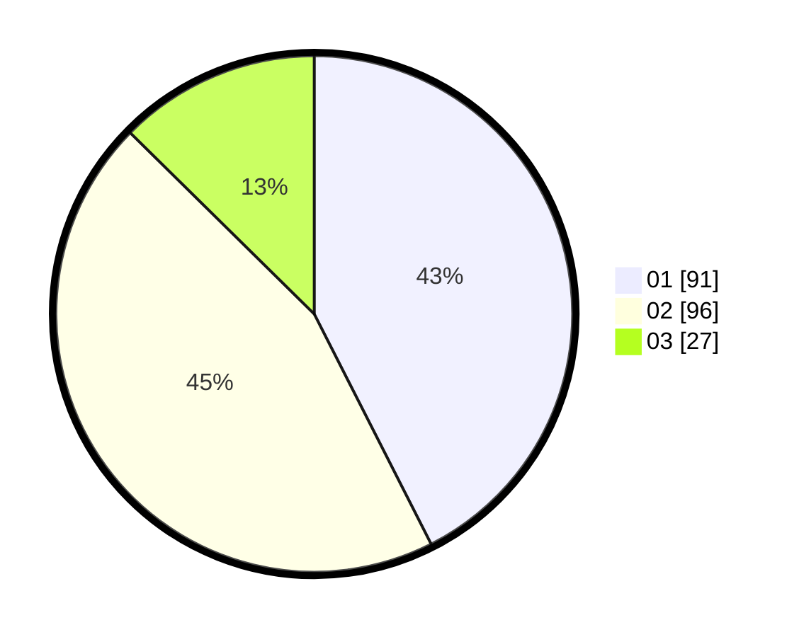

# Hasil

Hasil perolehan suara paslon dapat dilihat pada file paslon-01.txt, paslon-02.txt, dan paslon-03.txt.

Jika tidak ada, artinya data tersebut belum ada pada SIREKAP.

## Perolehan Suara

 * Paslon 01: **91**.
 * Paslon 02: **96**.
 * Paslon 03: **27**.

## Foto C Plano

https://sirekap-obj-formc.kpu.go.id/9523/pemilu/ppwp/31/73/07/10/01/3173071001034-20240214-232833--7dc8630a-d3cb-4f49-821b-95421dd75389.jpg

https://sirekap-obj-formc.kpu.go.id/9523/pemilu/ppwp/31/73/07/10/01/3173071001034-20240214-232953--ff01e018-8b50-4868-83c5-b693060e52c9.jpg

https://sirekap-obj-formc.kpu.go.id/9523/pemilu/ppwp/31/73/07/10/01/3173071001034-20240214-233113--83c5af3c-c1ab-4505-83f4-55f0c9a52efa.jpg
