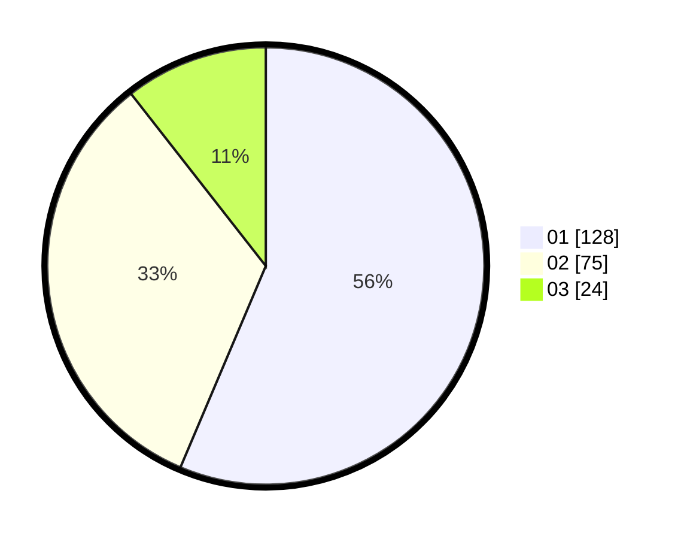

# Hasil

Hasil perolehan suara paslon dapat dilihat pada file paslon-01.txt, paslon-02.txt, dan paslon-03.txt.

Jika tidak ada, artinya data tersebut belum ada pada SIREKAP.

## Perolehan Suara

 * Paslon 01: **128**.
 * Paslon 02: **75**.
 * Paslon 03: **24**.

## Foto C Plano

https://sirekap-obj-formc.kpu.go.id/0220/pemilu/ppwp/31/73/07/10/01/3173071001035-20240215-002836--e2d8f0b5-6126-4386-be5c-dddc8161d744.jpg

https://sirekap-obj-formc.kpu.go.id/0220/pemilu/ppwp/31/73/07/10/01/3173071001035-20240215-003053--3693ca7f-34d2-4ef0-8b8c-d48b88a0930f.jpg

https://sirekap-obj-formc.kpu.go.id/0220/pemilu/ppwp/31/73/07/10/01/3173071001035-20240215-003239--59abd5e9-c2ec-4175-ae1f-26c0126c178b.jpg
