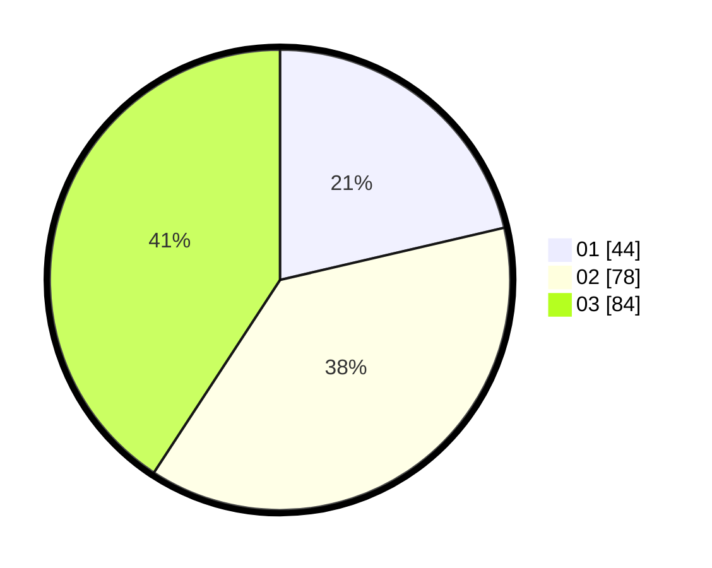

# Hasil

Hasil perolehan suara paslon dapat dilihat pada file paslon-01.txt, paslon-02.txt, dan paslon-03.txt.

Jika tidak ada, artinya data tersebut belum ada pada SIREKAP.

## Perolehan Suara

 * Paslon 01: **44**.
 * Paslon 02: **78**.
 * Paslon 03: **84**.

## Foto C Plano

https://sirekap-obj-formc.kpu.go.id/b836/pemilu/ppwp/31/73/07/10/01/3173071001037-20240214-231231--eaf44475-e5fe-4352-a38b-1380c13ade6a.jpg

https://sirekap-obj-formc.kpu.go.id/b836/pemilu/ppwp/31/73/07/10/01/3173071001037-20240214-212125--7fd6c36d-8e9e-43cd-9452-9b6dc40b7ef2.jpg

https://sirekap-obj-formc.kpu.go.id/b836/pemilu/ppwp/31/73/07/10/01/3173071001037-20240214-203128--13676e40-a028-4425-af5b-0d544480922e.jpg
