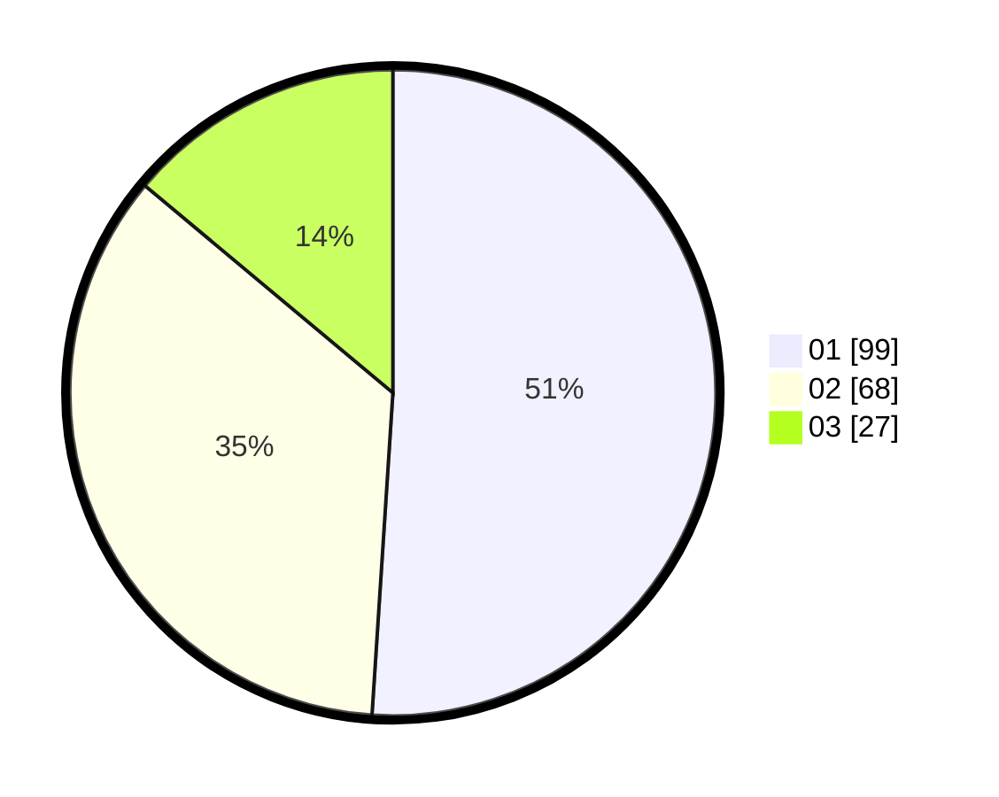

# Hasil

Hasil perolehan suara paslon dapat dilihat pada file paslon-01.txt, paslon-02.txt, dan paslon-03.txt.

Jika tidak ada, artinya data tersebut belum ada pada SIREKAP.

## Perolehan Suara

 * Paslon 01: **99**.
 * Paslon 02: **68**.
 * Paslon 03: **27**.

## Foto C Plano

https://sirekap-obj-formc.kpu.go.id/d212/pemilu/ppwp/31/73/07/10/01/3173071001040-20240214-231608--a1dfd745-de48-472b-945f-f9fb2f9923f5.jpg

https://sirekap-obj-formc.kpu.go.id/d212/pemilu/ppwp/31/73/07/10/01/3173071001040-20240215-000315--2ce7c0db-71d3-49d3-a19f-60ab8accde65.jpg
