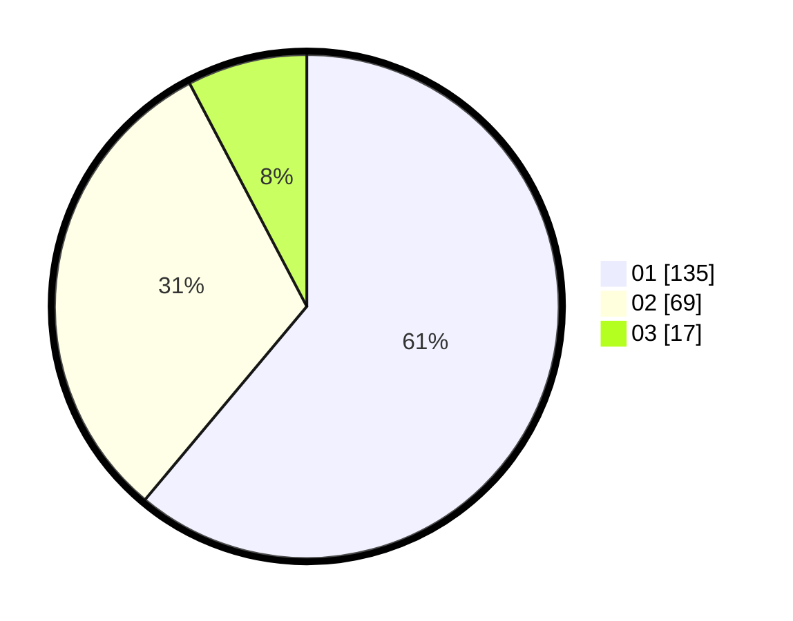

# Hasil

Hasil perolehan suara paslon dapat dilihat pada file paslon-01.txt, paslon-02.txt, dan paslon-03.txt.

Jika tidak ada, artinya data tersebut belum ada pada SIREKAP.

## Perolehan Suara

 * Paslon 01: **135**.
 * Paslon 02: **69**.
 * Paslon 03: **17**.

## Foto C Plano

https://sirekap-obj-formc.kpu.go.id/00f3/pemilu/ppwp/31/73/07/10/01/3173071001041-20240214-213636--efe4a7a5-fa06-4eee-8bd7-37df63bae18f.jpg

https://sirekap-obj-formc.kpu.go.id/00f3/pemilu/ppwp/31/73/07/10/01/3173071001041-20240214-213658--829bef57-328d-40f9-8195-560eae6561ad.jpg

https://sirekap-obj-formc.kpu.go.id/00f3/pemilu/ppwp/31/73/07/10/01/3173071001041-20240214-213722--3b94a8a7-7c22-46d2-8d4d-ea0e8b4a7ebd.jpg
