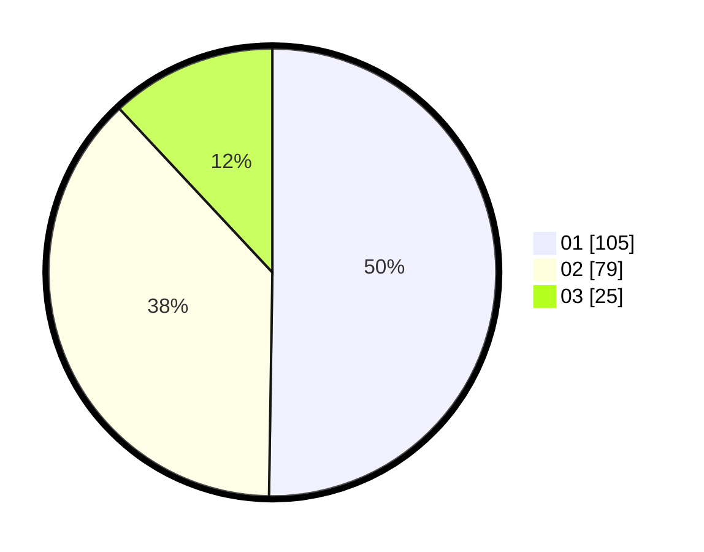

# Hasil

Hasil perolehan suara paslon dapat dilihat pada file paslon-01.txt, paslon-02.txt, dan paslon-03.txt.

Jika tidak ada, artinya data tersebut belum ada pada SIREKAP.

## Perolehan Suara

 * Paslon 01: **105**.
 * Paslon 02: **79**.
 * Paslon 03: **25**.

## Foto C Plano

https://sirekap-obj-formc.kpu.go.id/f586/pemilu/ppwp/31/73/07/10/01/3173071001042-20240215-011252--d1282b03-cdb2-41d6-ae95-58271c1ca425.jpg

https://sirekap-obj-formc.kpu.go.id/f586/pemilu/ppwp/31/73/07/10/01/3173071001042-20240215-011257--fbe547ff-a3d5-42d8-8d69-07c128de2b75.jpg

https://sirekap-obj-formc.kpu.go.id/f586/pemilu/ppwp/31/73/07/10/01/3173071001042-20240215-011300--2f0547f0-fb24-43f8-b704-22359957a25c.jpg
