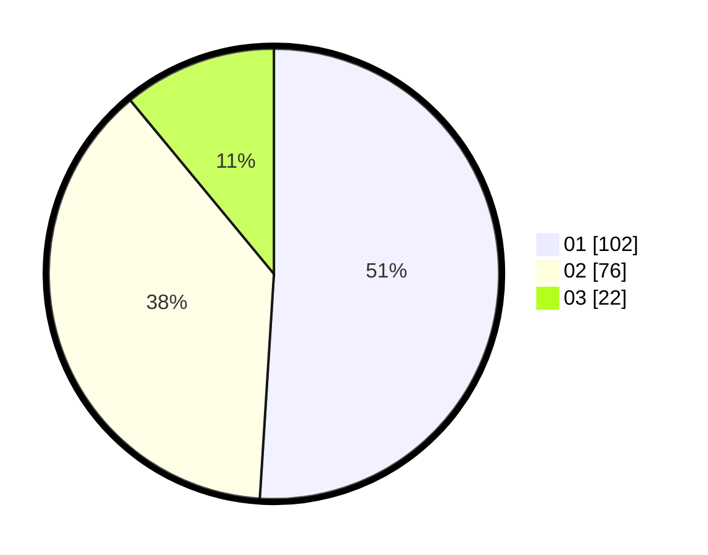

# Hasil

Hasil perolehan suara paslon dapat dilihat pada file paslon-01.txt, paslon-02.txt, dan paslon-03.txt.

Jika tidak ada, artinya data tersebut belum ada pada SIREKAP.

## Perolehan Suara

 * Paslon 01: **102**.
 * Paslon 02: **76**.
 * Paslon 03: **22**.

## Foto C Plano

https://sirekap-obj-formc.kpu.go.id/ff7d/pemilu/ppwp/31/73/07/10/01/3173071001045-20240214-231615--7fe5ef1a-b44c-4666-8895-08545bfa023a.jpg

https://sirekap-obj-formc.kpu.go.id/ff7d/pemilu/ppwp/31/73/07/10/01/3173071001045-20240214-231725--ef9cf8d5-c44f-470b-9496-0ca94c8fdccb.jpg

https://sirekap-obj-formc.kpu.go.id/ff7d/pemilu/ppwp/31/73/07/10/01/3173071001045-20240214-231803--c2916520-781c-44f2-9d0e-8ffe0211cdfc.jpg
