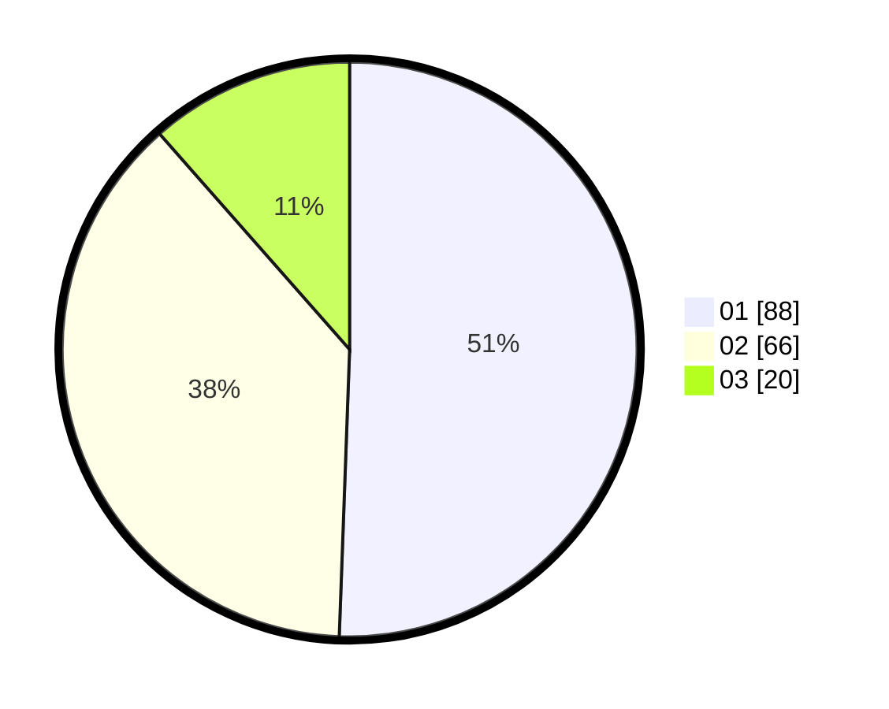

# Hasil

Hasil perolehan suara paslon dapat dilihat pada file paslon-01.txt, paslon-02.txt, dan paslon-03.txt.

Jika tidak ada, artinya data tersebut belum ada pada SIREKAP.

## Perolehan Suara

 * Paslon 01: **88**.
 * Paslon 02: **66**.
 * Paslon 03: **20**.

## Foto C Plano

https://sirekap-obj-formc.kpu.go.id/b450/pemilu/ppwp/31/73/07/10/01/3173071001046-20240214-155650--0ddce797-be2e-4a30-be14-dbd34312c542.jpg

https://sirekap-obj-formc.kpu.go.id/b450/pemilu/ppwp/31/73/07/10/01/3173071001046-20240214-160139--8492d48c-d224-403b-ad5c-2d56200b16b1.jpg

https://sirekap-obj-formc.kpu.go.id/b450/pemilu/ppwp/31/73/07/10/01/3173071001046-20240214-210330--6d90f87e-cee2-463a-a2f7-77f54dbb050e.jpg

## DATA PEMILIH TETAP

Jumlah pemilih dalam DPT: **220**.
 * L: **107**.
 * P: **113**.

## DATA PENGGUNA HAK PILIH

Jumlah pengguna hak pilih dalam DPT: **171**.
 * L: **78**.
 * P: **93**.

Jumlah pengguna hak pilih dalam DPTb: **1**.
 * L: **0**.
 * P: **1**.

Jumlah pengguna hak pilih dalam DPK: **2**.
 * L: **0**.
 * P: **2**.

Jumlah pengguna hak pilih: **174**.
 * L: **78**.
 * P: **96**.

## JUMLAH SUARA SAH DAN TIDAK SAH

JUMLAH SELURUH SUARA SAH: **174**.

JUMLAH SUARA TIDAK SAH: **0**.

JUMLAH SELURUH SUARA SAH DAN SUARA TIDAK SAH: **174**.
