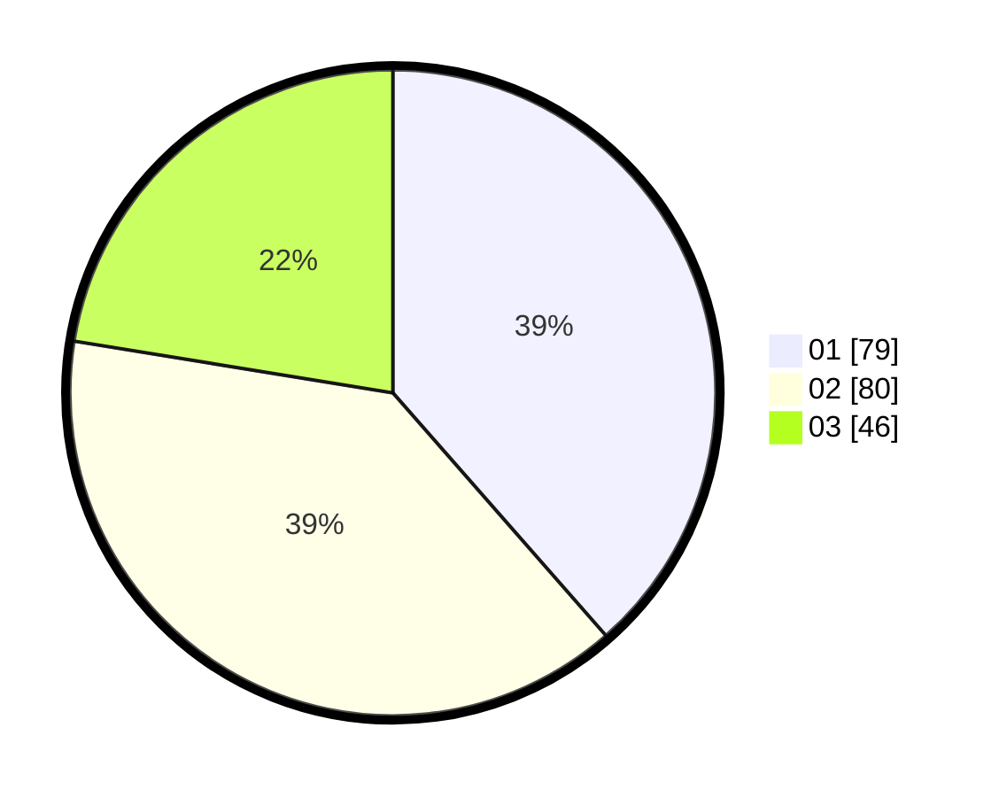

# Hasil

Hasil perolehan suara paslon dapat dilihat pada file paslon-01.txt, paslon-02.txt, dan paslon-03.txt.

Jika tidak ada, artinya data tersebut belum ada pada SIREKAP.

## Perolehan Suara

 * Paslon 01: **79**.
 * Paslon 02: **80**.
 * Paslon 03: **46**.

## Foto C Plano

https://sirekap-obj-formc.kpu.go.id/558d/pemilu/ppwp/31/73/07/10/01/3173071001051-20240214-213121--e337d2d7-2338-412b-bc48-3c37b2ce5736.jpg

https://sirekap-obj-formc.kpu.go.id/558d/pemilu/ppwp/31/73/07/10/01/3173071001051-20240214-213634--b2181380-23a9-43ae-917c-9d1daad5e5a3.jpg

https://sirekap-obj-formc.kpu.go.id/558d/pemilu/ppwp/31/73/07/10/01/3173071001051-20240214-213822--ac17d914-7e9f-4f0f-8384-1a61fe18ef23.jpg
