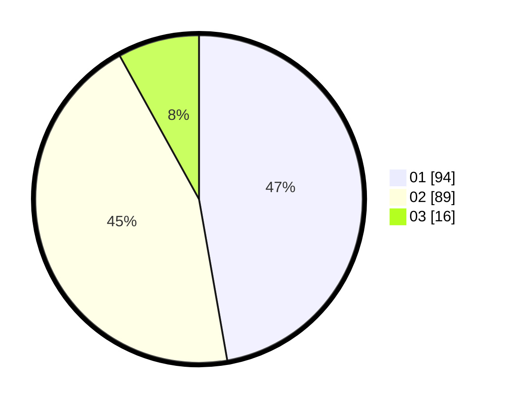

# Hasil

Hasil perolehan suara paslon dapat dilihat pada file paslon-01.txt, paslon-02.txt, dan paslon-03.txt.

Jika tidak ada, artinya data tersebut belum ada pada SIREKAP.

## Perolehan Suara

 * Paslon 01: **94**.
 * Paslon 02: **89**.
 * Paslon 03: **16**.

## Foto C Plano

https://sirekap-obj-formc.kpu.go.id/49b3/pemilu/ppwp/31/73/07/10/01/3173071001053-20240214-233212--53265985-9be5-46ce-8c16-ecacb613ad92.jpg

https://sirekap-obj-formc.kpu.go.id/49b3/pemilu/ppwp/31/73/07/10/01/3173071001053-20240214-205534--b76ea8e1-e450-4955-bd5e-3a72e65332b9.jpg

https://sirekap-obj-formc.kpu.go.id/49b3/pemilu/ppwp/31/73/07/10/01/3173071001053-20240214-210017--4a664c68-c4d6-4b54-b237-b8ac2705a8c3.jpg
