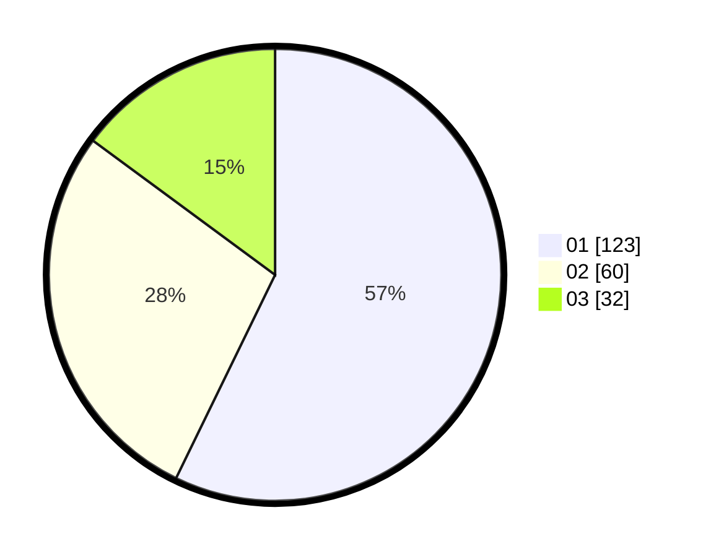

# Hasil

Hasil perolehan suara paslon dapat dilihat pada file paslon-01.txt, paslon-02.txt, dan paslon-03.txt.

Jika tidak ada, artinya data tersebut belum ada pada SIREKAP.

## Perolehan Suara

 * Paslon 01: **123**.
 * Paslon 02: **60**.
 * Paslon 03: **32**.

## Foto C Plano

https://sirekap-obj-formc.kpu.go.id/547c/pemilu/ppwp/31/73/07/10/01/3173071001054-20240214-224911--b5193465-e67e-4237-8339-14e65c1b1bc2.jpg

https://sirekap-obj-formc.kpu.go.id/547c/pemilu/ppwp/31/73/07/10/01/3173071001054-20240214-202940--b7d2133f-7526-4429-a8ae-81bc48590c8c.jpg

https://sirekap-obj-formc.kpu.go.id/547c/pemilu/ppwp/31/73/07/10/01/3173071001054-20240214-202954--23bb6407-f981-4b00-b19d-07110cdb8a26.jpg

## DATA PEMILIH TETAP

Jumlah pemilih dalam DPT: **265**.
 * L: **135**.
 * P: **130**.

## DATA PENGGUNA HAK PILIH

Jumlah pengguna hak pilih dalam DPT: **216**.
 * L: **106**.
 * P: **110**.

Jumlah pengguna hak pilih dalam DPTb: **0**.
 * L: **0**.
 * P: **0**.

Jumlah pengguna hak pilih dalam DPK: **3**.
 * L: **1**.
 * P: **2**.

Jumlah pengguna hak pilih: **219**.
 * L: **107**.
 * P: **112**.

## JUMLAH SUARA SAH DAN TIDAK SAH

JUMLAH SELURUH SUARA SAH: **215**.

JUMLAH SUARA TIDAK SAH: **4**.

JUMLAH SELURUH SUARA SAH DAN SUARA TIDAK SAH: **219**.
