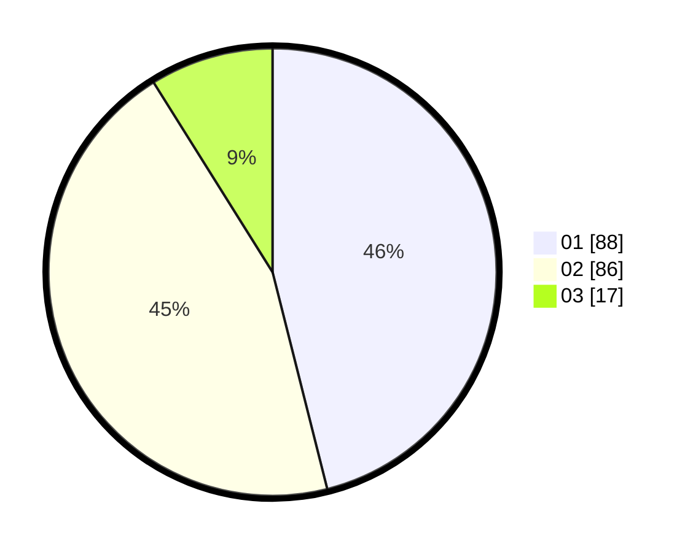

# Hasil

Hasil perolehan suara paslon dapat dilihat pada file paslon-01.txt, paslon-02.txt, dan paslon-03.txt.

Jika tidak ada, artinya data tersebut belum ada pada SIREKAP.

## Perolehan Suara

 * Paslon 01: **88**.
 * Paslon 02: **86**.
 * Paslon 03: **17**.

## Foto C Plano

https://sirekap-obj-formc.kpu.go.id/8f89/pemilu/ppwp/31/73/07/10/01/3173071001055-20240214-190903--8f8d02ca-ab4b-4f25-aa02-5f62293065a4.jpg

https://sirekap-obj-formc.kpu.go.id/8f89/pemilu/ppwp/31/73/07/10/01/3173071001055-20240214-190704--3f7f6c1e-8a93-483f-b0c4-2062fd854dc7.jpg

https://sirekap-obj-formc.kpu.go.id/8f89/pemilu/ppwp/31/73/07/10/01/3173071001055-20240214-190751--6543e066-14fa-4d9b-bdcd-9811be26d1ab.jpg

## DATA PEMILIH TETAP

Jumlah pemilih dalam DPT: **234**.
 * L: **124**.
 * P: **110**.

## DATA PENGGUNA HAK PILIH

Jumlah pengguna hak pilih dalam DPT: **191**.
 * L: **97**.
 * P: **94**.

Jumlah pengguna hak pilih dalam DPTb: **2**.
 * L: **0**.
 * P: **2**.

Jumlah pengguna hak pilih dalam DPK: **1**.
 * L: **1**.
 * P: **0**.

Jumlah pengguna hak pilih: **194**.
 * L: **99**.
 * P: **97**.

## JUMLAH SUARA SAH DAN TIDAK SAH

JUMLAH SELURUH SUARA SAH: **141**.

JUMLAH SUARA TIDAK SAH: **7**.

JUMLAH SELURUH SUARA SAH DAN SUARA TIDAK SAH: **194**.
