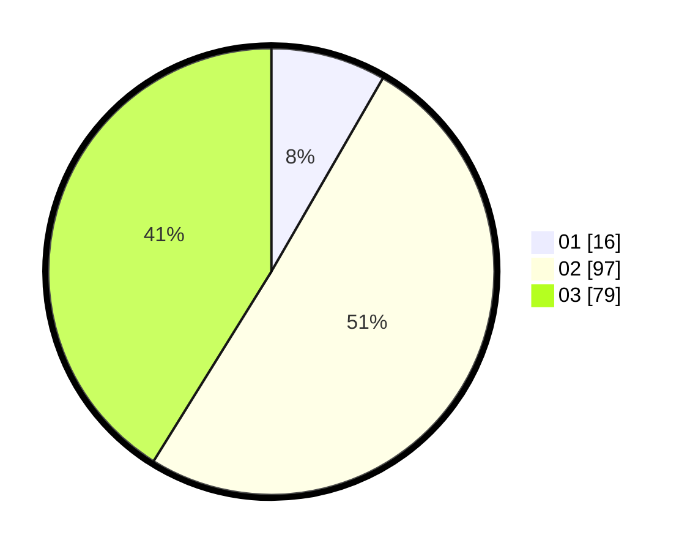

# Hasil

Hasil perolehan suara paslon dapat dilihat pada file paslon-01.txt, paslon-02.txt, dan paslon-03.txt.

Jika tidak ada, artinya data tersebut belum ada pada SIREKAP.

## Perolehan Suara

 * Paslon 01: **16**.
 * Paslon 02: **97**.
 * Paslon 03: **79**.

## Foto C Plano

https://sirekap-obj-formc.kpu.go.id/9302/pemilu/ppwp/31/73/07/10/01/3173071001056-20240214-225009--17ea8854-b938-451e-bc23-af19edef8e98.jpg

https://sirekap-obj-formc.kpu.go.id/9302/pemilu/ppwp/31/73/07/10/01/3173071001056-20240214-220855--befcd8c8-7a6c-4139-8dd5-a92ee63c209c.jpg

https://sirekap-obj-formc.kpu.go.id/9302/pemilu/ppwp/31/73/07/10/01/3173071001056-20240214-213644--2dcece74-9f91-4e3a-8dce-d995493e4688.jpg
