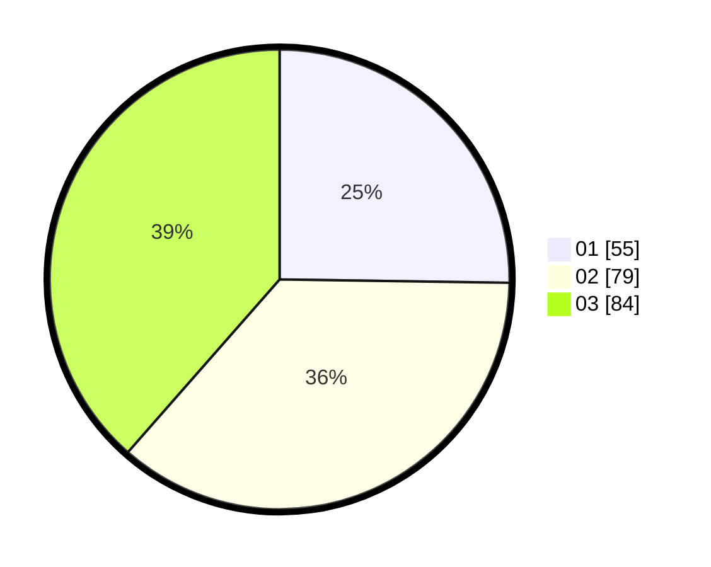

# Hasil

Hasil perolehan suara paslon dapat dilihat pada file paslon-01.txt, paslon-02.txt, dan paslon-03.txt.

Jika tidak ada, artinya data tersebut belum ada pada SIREKAP.

## Perolehan Suara

 * Paslon 01: **55**.
 * Paslon 02: **79**.
 * Paslon 03: **84**.

## Foto C Plano

https://sirekap-obj-formc.kpu.go.id/47de/pemilu/ppwp/31/73/07/10/01/3173071001057-20240214-220153--3acd0f18-186e-4e6d-b75c-68fcd830bf12.jpg

https://sirekap-obj-formc.kpu.go.id/47de/pemilu/ppwp/31/73/07/10/01/3173071001057-20240214-212112--d3132649-9444-47ca-9a9e-5b1f2e0e20f0.jpg

https://sirekap-obj-formc.kpu.go.id/47de/pemilu/ppwp/31/73/07/10/01/3173071001057-20240214-195121--661591a1-0913-45dc-b4a5-c8d5801b83b3.jpg
