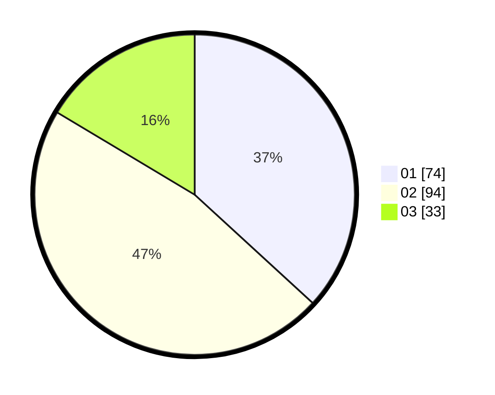

# Hasil

Hasil perolehan suara paslon dapat dilihat pada file paslon-01.txt, paslon-02.txt, dan paslon-03.txt.

Jika tidak ada, artinya data tersebut belum ada pada SIREKAP.

## Perolehan Suara

 * Paslon 01: **74**.
 * Paslon 02: **94**.
 * Paslon 03: **33**.

## Foto C Plano

https://sirekap-obj-formc.kpu.go.id/a04b/pemilu/ppwp/31/73/07/10/01/3173071001059-20240217-113545--79cf028c-9cc7-4e8e-8df4-a48d3ff13000.jpg

https://sirekap-obj-formc.kpu.go.id/a04b/pemilu/ppwp/31/73/07/10/01/3173071001059-20240217-112809--8de02003-1963-40c6-b315-452b0f68d491.jpg

https://sirekap-obj-formc.kpu.go.id/a04b/pemilu/ppwp/31/73/07/10/01/3173071001059-20240217-113013--04611202-ea63-43a4-8a87-36b5a4c964f5.jpg

## DATA PEMILIH TETAP

Jumlah pemilih dalam DPT: **253**.
 * L: **123**.
 * P: **130**.

## DATA PENGGUNA HAK PILIH

Jumlah pengguna hak pilih dalam DPT: **201**.
 * L: **92**.
 * P: **109**.

Jumlah pengguna hak pilih dalam DPTb: **1**.
 * L: **1**.
 * P: **0**.

Jumlah pengguna hak pilih dalam DPK: **0**.
 * L: **0**.
 * P: **0**.

Jumlah pengguna hak pilih: **202**.
 * L: **93**.
 * P: **109**.

## JUMLAH SUARA SAH DAN TIDAK SAH

JUMLAH SELURUH SUARA SAH: **201**.

JUMLAH SUARA TIDAK SAH: **1**.

JUMLAH SELURUH SUARA SAH DAN SUARA TIDAK SAH: **202**.
