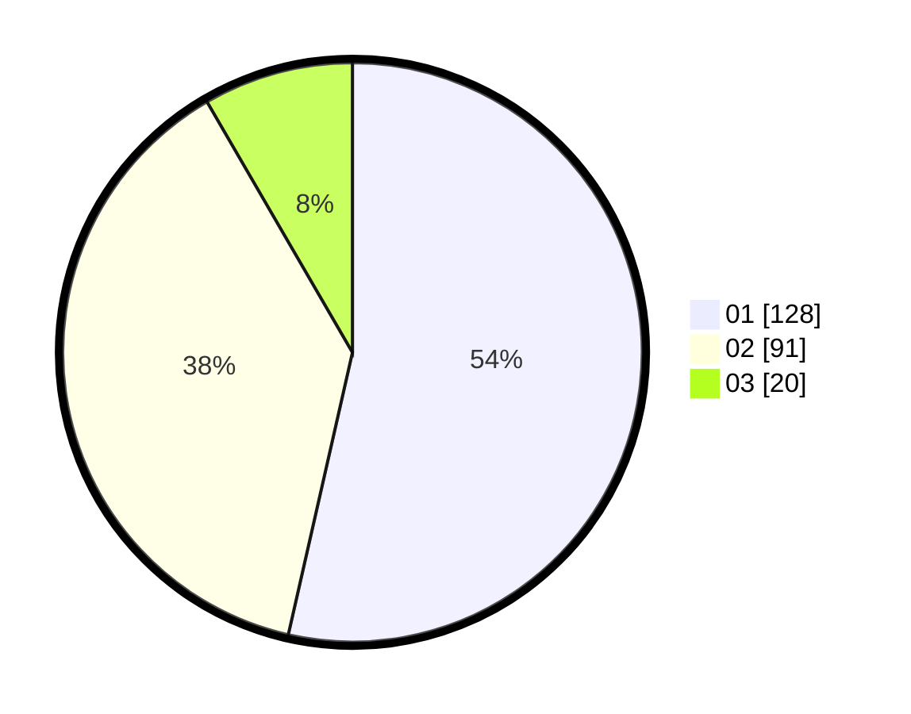

# Hasil

Hasil perolehan suara paslon dapat dilihat pada file paslon-01.txt, paslon-02.txt, dan paslon-03.txt.

Jika tidak ada, artinya data tersebut belum ada pada SIREKAP.

## Perolehan Suara

 * Paslon 01: **128**.
 * Paslon 02: **91**.
 * Paslon 03: **20**.

## Foto C Plano

https://sirekap-obj-formc.kpu.go.id/0391/pemilu/ppwp/31/73/07/10/01/3173071001064-20240214-205444--26d5a834-1e09-40ec-8039-d59955c8fb10.jpg

https://sirekap-obj-formc.kpu.go.id/0391/pemilu/ppwp/31/73/07/10/01/3173071001064-20240214-205506--fc919326-102f-4f62-91e7-b4d6ad771c23.jpg
