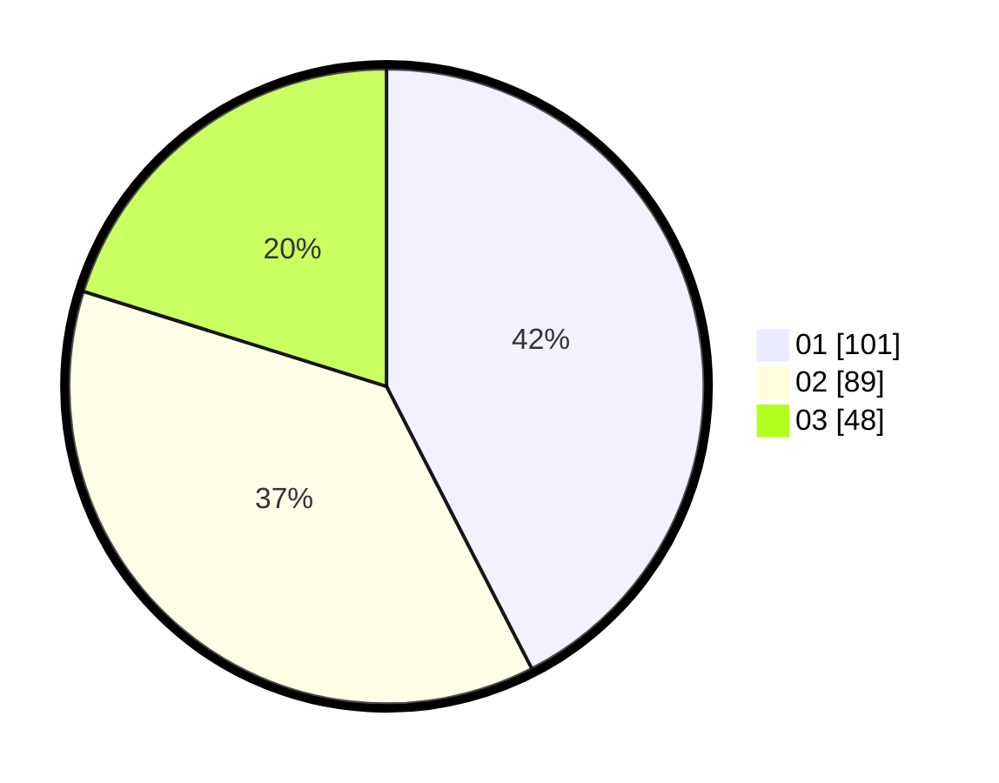

# Hasil

Hasil perolehan suara paslon dapat dilihat pada file paslon-01.txt, paslon-02.txt, dan paslon-03.txt.

Jika tidak ada, artinya data tersebut belum ada pada SIREKAP.

## Perolehan Suara

 * Paslon 01: **101**.
 * Paslon 02: **89**.
 * Paslon 03: **48**.

## Foto C Plano

https://sirekap-obj-formc.kpu.go.id/cf09/pemilu/ppwp/31/73/07/10/01/3173071001065-20240214-222943--8b24bcd9-aec0-401f-bcd5-ef2e4c37d4b7.jpg

https://sirekap-obj-formc.kpu.go.id/cf09/pemilu/ppwp/31/73/07/10/01/3173071001065-20240214-223006--9b282c7c-5035-4948-87af-31d16652c1e2.jpg

https://sirekap-obj-formc.kpu.go.id/cf09/pemilu/ppwp/31/73/07/10/01/3173071001065-20240214-223032--cc9b3926-c4df-4e1c-9f54-0a24d7da17a9.jpg
