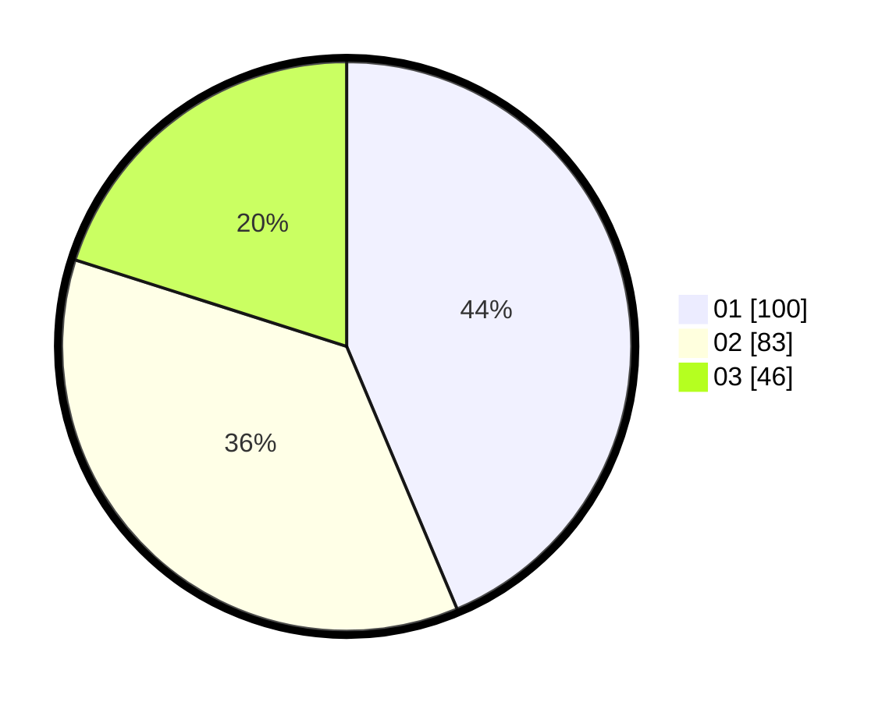

# Hasil

Hasil perolehan suara paslon dapat dilihat pada file paslon-01.txt, paslon-02.txt, dan paslon-03.txt.

Jika tidak ada, artinya data tersebut belum ada pada SIREKAP.

## Perolehan Suara

 * Paslon 01: **100**.
 * Paslon 02: **83**.
 * Paslon 03: **46**.

## Foto C Plano

https://sirekap-obj-formc.kpu.go.id/5045/pemilu/ppwp/31/73/07/10/01/3173071001068-20240215-025203--2e7a0bfd-34e2-4804-b0de-270d99dacef8.jpg

https://sirekap-obj-formc.kpu.go.id/5045/pemilu/ppwp/31/73/07/10/01/3173071001068-20240215-025511--94030c78-e914-4df8-97b1-41ff0edad80c.jpg

https://sirekap-obj-formc.kpu.go.id/5045/pemilu/ppwp/31/73/07/10/01/3173071001068-20240215-003511--8df66840-29ae-4684-9d41-d21c7d66babb.jpg
