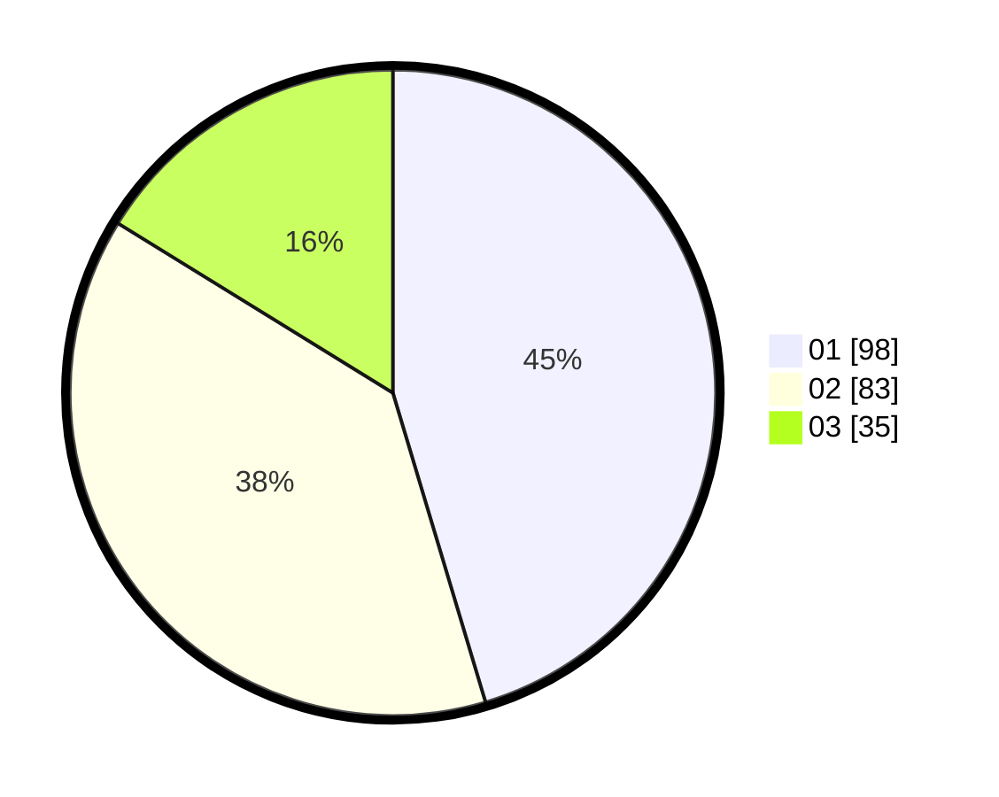

# Hasil

Hasil perolehan suara paslon dapat dilihat pada file paslon-01.txt, paslon-02.txt, dan paslon-03.txt.

Jika tidak ada, artinya data tersebut belum ada pada SIREKAP.

## Perolehan Suara

 * Paslon 01: **98**.
 * Paslon 02: **83**.
 * Paslon 03: **35**.

## Foto C Plano

https://sirekap-obj-formc.kpu.go.id/c693/pemilu/ppwp/31/73/07/10/01/3173071001069-20240214-225455--1dd23d0e-1b59-48d4-b627-e6af4e7820a9.jpg

https://sirekap-obj-formc.kpu.go.id/c693/pemilu/ppwp/31/73/07/10/01/3173071001069-20240214-225838--504e2d88-4cf2-41eb-ae92-74f62cb9315c.jpg

https://sirekap-obj-formc.kpu.go.id/c693/pemilu/ppwp/31/73/07/10/01/3173071001069-20240214-230010--5a66f19d-5b7d-4e5e-9105-542511e3d7de.jpg
