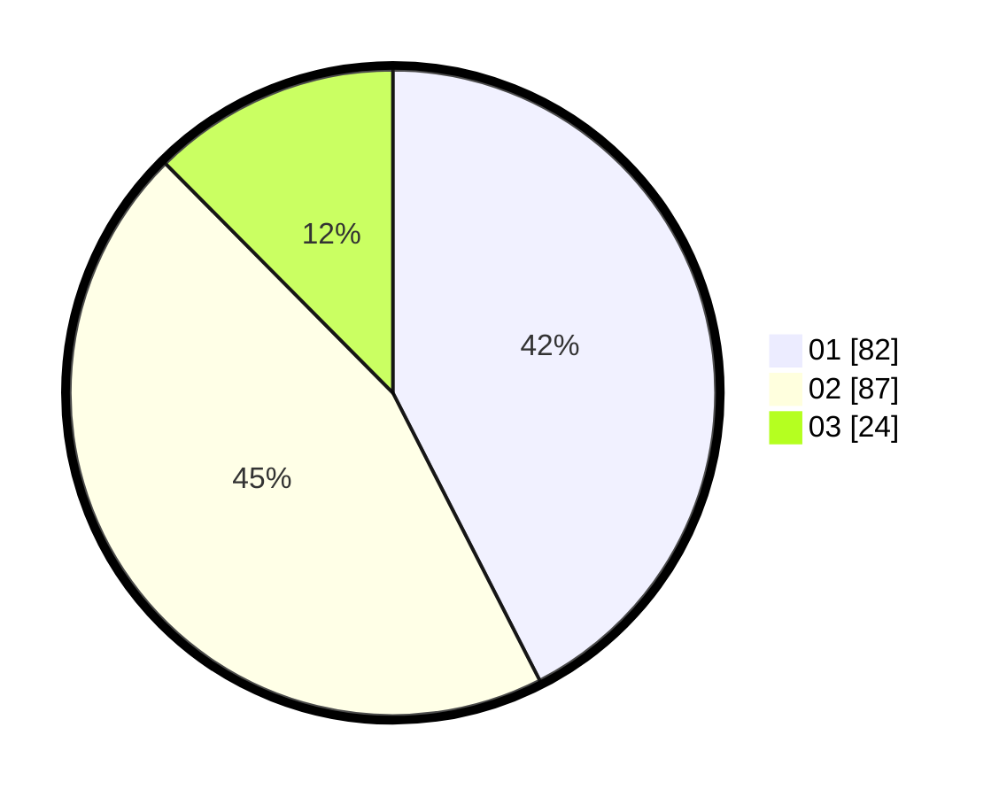

# Hasil

Hasil perolehan suara paslon dapat dilihat pada file paslon-01.txt, paslon-02.txt, dan paslon-03.txt.

Jika tidak ada, artinya data tersebut belum ada pada SIREKAP.

## Perolehan Suara

 * Paslon 01: **82**.
 * Paslon 02: **87**.
 * Paslon 03: **24**.

## Foto C Plano

https://sirekap-obj-formc.kpu.go.id/4f2c/pemilu/ppwp/31/73/07/10/01/3173071001075-20240214-155441--3abeb102-211c-4104-a716-bca36700f0db.jpg

https://sirekap-obj-formc.kpu.go.id/4f2c/pemilu/ppwp/31/73/07/10/01/3173071001075-20240214-155545--94b37f89-f089-4ac3-bffb-c659479a4d9d.jpg

https://sirekap-obj-formc.kpu.go.id/4f2c/pemilu/ppwp/31/73/07/10/01/3173071001075-20240214-155644--6547c4d0-ed5d-4df2-a565-591b44dfe82c.jpg
