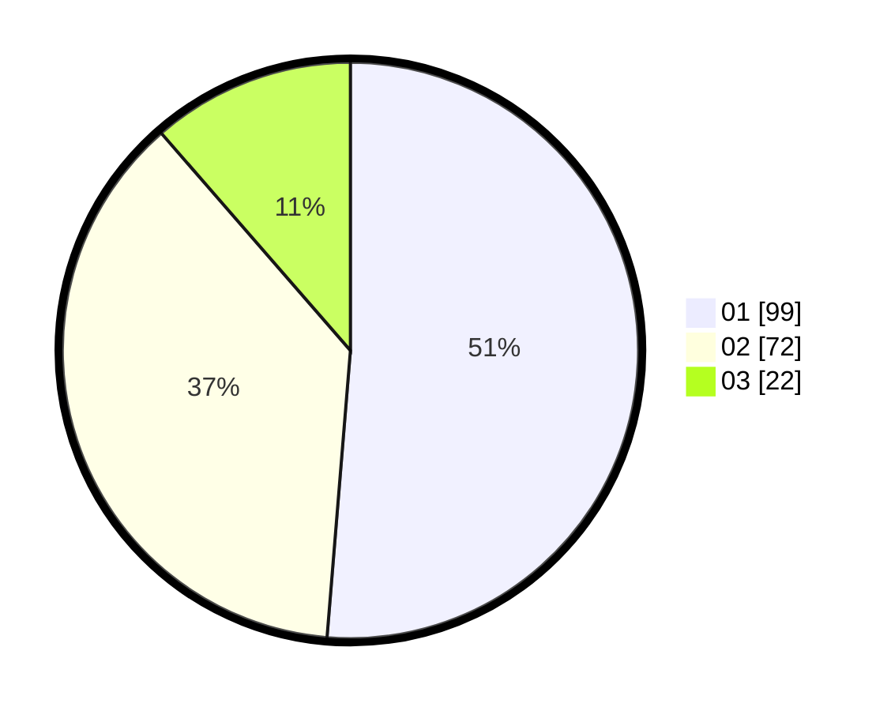

# Hasil

Hasil perolehan suara paslon dapat dilihat pada file paslon-01.txt, paslon-02.txt, dan paslon-03.txt.

Jika tidak ada, artinya data tersebut belum ada pada SIREKAP.

## Perolehan Suara

 * Paslon 01: **99**.
 * Paslon 02: **72**.
 * Paslon 03: **22**.

## Foto C Plano

https://sirekap-obj-formc.kpu.go.id/f6f2/pemilu/ppwp/31/73/07/10/01/3173071001080-20240214-220739--59c1a9c1-f73b-455e-ba5e-cb8dc1f7cf80.jpg

https://sirekap-obj-formc.kpu.go.id/f6f2/pemilu/ppwp/31/73/07/10/01/3173071001080-20240214-221142--448e7e28-e1f7-4846-ab2f-cb0b5a9dccc1.jpg

https://sirekap-obj-formc.kpu.go.id/f6f2/pemilu/ppwp/31/73/07/10/01/3173071001080-20240214-221434--df96e827-24ae-4e8c-953e-1a3c1e7ad7cc.jpg
