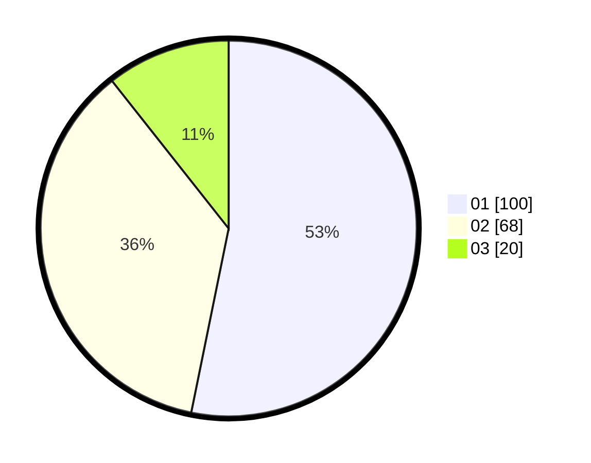

# Hasil

Hasil perolehan suara paslon dapat dilihat pada file paslon-01.txt, paslon-02.txt, dan paslon-03.txt.

Jika tidak ada, artinya data tersebut belum ada pada SIREKAP.

## Perolehan Suara

 * Paslon 01: **100**.
 * Paslon 02: **68**.
 * Paslon 03: **20**.

## Foto C Plano

https://sirekap-obj-formc.kpu.go.id/8065/pemilu/ppwp/31/73/07/10/01/3173071001082-20240214-211738--eeb9a7f4-fe88-4daa-8708-691787c22bcd.jpg

https://sirekap-obj-formc.kpu.go.id/8065/pemilu/ppwp/31/73/07/10/01/3173071001082-20240214-211747--df6e0f71-c728-4401-8493-299900c6e8d0.jpg

https://sirekap-obj-formc.kpu.go.id/8065/pemilu/ppwp/31/73/07/10/01/3173071001082-20240214-211758--3a5a6c38-1e9b-41aa-9e04-8d9da98493b4.jpg
