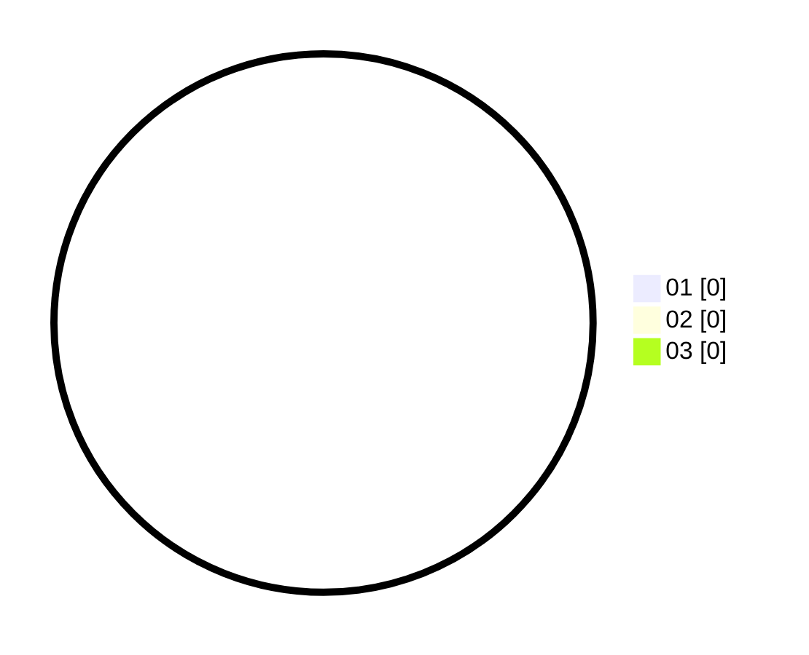

# Hasil

Hasil perolehan suara paslon dapat dilihat pada file paslon-01.txt, paslon-02.txt, dan paslon-03.txt.

Jika tidak ada, artinya data tersebut belum ada pada SIREKAP.

## Perolehan Suara

 * Paslon 01: **0**.
 * Paslon 02: **0**.
 * Paslon 03: **0**.

## Foto C Plano

https://sirekap-obj-formc.kpu.go.id/af91/pemilu/ppwp/31/73/07/10/01/3173071001090-20240215-005926--d911745c-20d6-4dcc-8f29-363bd1e64de4.jpg

https://sirekap-obj-formc.kpu.go.id/af91/pemilu/ppwp/31/73/07/10/01/3173071001090-20240215-010025--7a9da6fb-a423-4883-9364-58227c06c037.jpg

https://sirekap-obj-formc.kpu.go.id/af91/pemilu/ppwp/31/73/07/10/01/3173071001090-20240215-010151--106a8759-d265-4c93-a00a-7fe919d4f6b3.jpg
