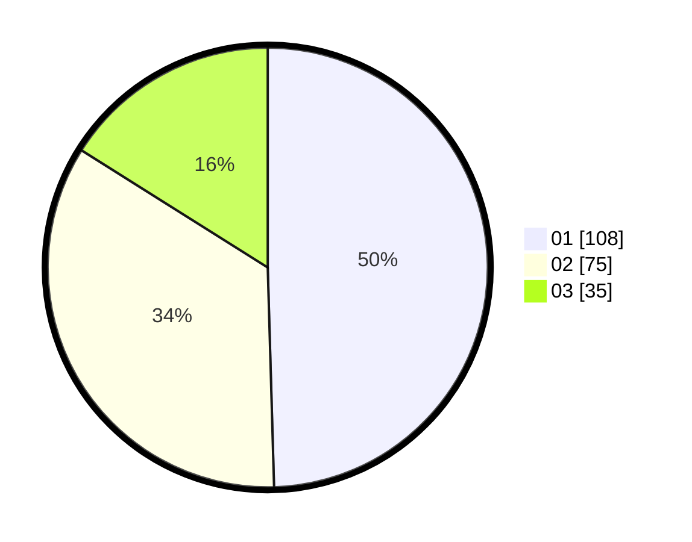

# Hasil

Hasil perolehan suara paslon dapat dilihat pada file paslon-01.txt, paslon-02.txt, dan paslon-03.txt.

Jika tidak ada, artinya data tersebut belum ada pada SIREKAP.

## Perolehan Suara

 * Paslon 01: **108**.
 * Paslon 02: **75**.
 * Paslon 03: **35**.

## Foto C Plano

https://sirekap-obj-formc.kpu.go.id/eb59/pemilu/ppwp/31/73/07/10/01/3173071001091-20240214-225938--74efff6c-ddc5-476f-9866-fd16a2e73fb8.jpg

https://sirekap-obj-formc.kpu.go.id/eb59/pemilu/ppwp/31/73/07/10/01/3173071001091-20240214-230347--de0f7c50-e3d9-4476-acf0-f1f178a60b44.jpg

https://sirekap-obj-formc.kpu.go.id/eb59/pemilu/ppwp/31/73/07/10/01/3173071001091-20240214-230604--cdc24c59-d9c3-4d21-933d-731a2a438da7.jpg
