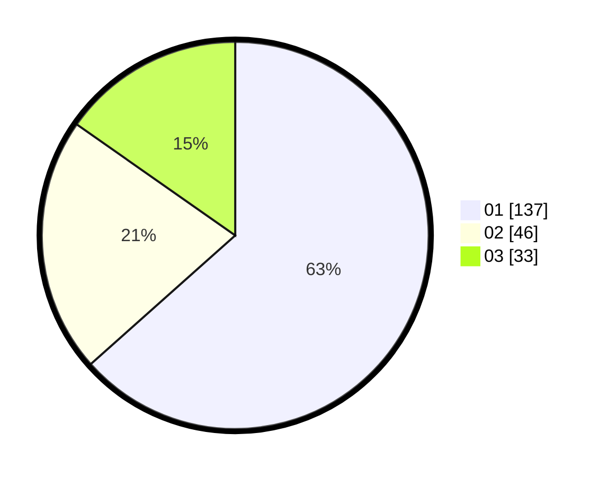

# Hasil

Hasil perolehan suara paslon dapat dilihat pada file paslon-01.txt, paslon-02.txt, dan paslon-03.txt.

Jika tidak ada, artinya data tersebut belum ada pada SIREKAP.

## Perolehan Suara

 * Paslon 01: **137**.
 * Paslon 02: **46**.
 * Paslon 03: **33**.

## Foto C Plano

https://sirekap-obj-formc.kpu.go.id/591a/pemilu/ppwp/31/73/07/10/01/3173071001098-20240215-023500--f116fb9e-8c9f-4c99-bc6c-160d01a26dec.jpg

https://sirekap-obj-formc.kpu.go.id/591a/pemilu/ppwp/31/73/07/10/01/3173071001098-20240215-015414--65f9e4d1-44fc-46b3-9c80-416429906fdf.jpg

https://sirekap-obj-formc.kpu.go.id/591a/pemilu/ppwp/31/73/07/10/01/3173071001098-20240215-002553--8958ca6b-ca09-41d5-b309-2380ef18c29d.jpg
