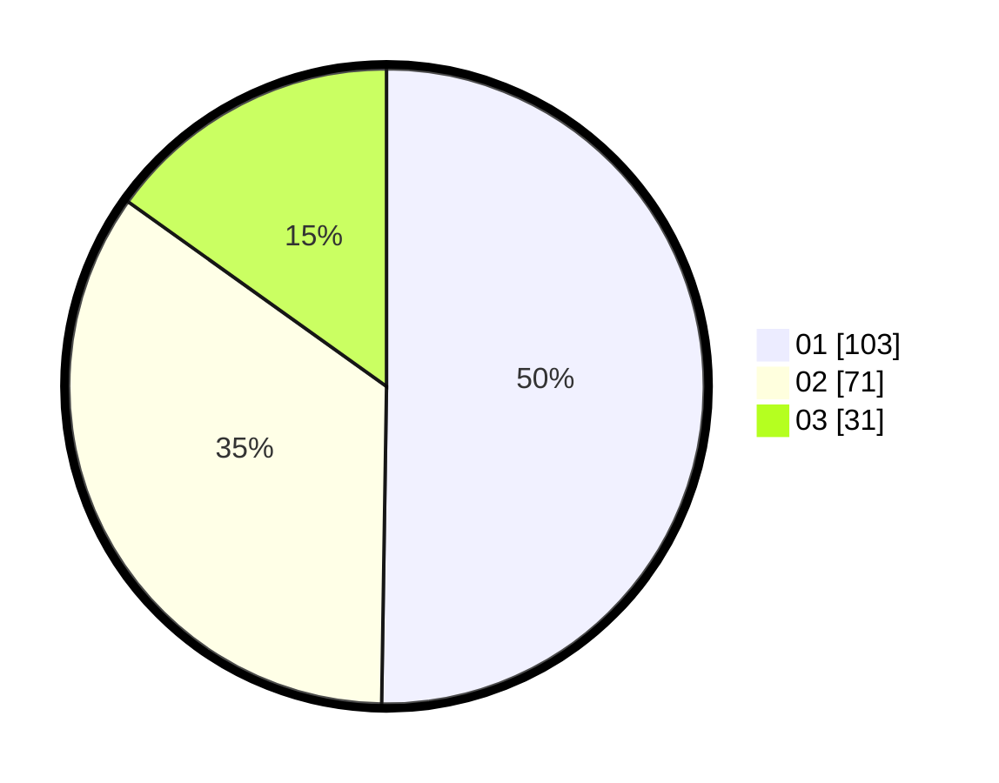

# Hasil

Hasil perolehan suara paslon dapat dilihat pada file paslon-01.txt, paslon-02.txt, dan paslon-03.txt.

Jika tidak ada, artinya data tersebut belum ada pada SIREKAP.

## Perolehan Suara

 * Paslon 01: **103**.
 * Paslon 02: **71**.
 * Paslon 03: **31**.

## Foto C Plano

https://sirekap-obj-formc.kpu.go.id/010f/pemilu/ppwp/31/73/07/10/01/3173071001101-20240214-231904--790268a4-9d6b-4927-a779-4c1939a85ee9.jpg

https://sirekap-obj-formc.kpu.go.id/010f/pemilu/ppwp/31/73/07/10/01/3173071001101-20240214-231947--8bd93364-e9d5-4243-889d-1f6e8d7f5df3.jpg

https://sirekap-obj-formc.kpu.go.id/010f/pemilu/ppwp/31/73/07/10/01/3173071001101-20240214-232209--1fd82e04-f4d0-4747-8dc0-7762f18dc1c5.jpg

## DATA PEMILIH TETAP

Jumlah pemilih dalam DPT: **267**.
 * L: **130**.
 * P: **137**.

## DATA PENGGUNA HAK PILIH

Jumlah pengguna hak pilih dalam DPT: **203**.
 * L: **93**.
 * P: **110**.

Jumlah pengguna hak pilih dalam DPTb: **1**.
 * L: **0**.
 * P: **1**.

Jumlah pengguna hak pilih dalam DPK: **2**.
 * L: **2**.
 * P: **0**.

Jumlah pengguna hak pilih: **206**.
 * L: **95**.
 * P: **111**.

## JUMLAH SUARA SAH DAN TIDAK SAH

JUMLAH SELURUH SUARA SAH: **205**.

JUMLAH SUARA TIDAK SAH: **1**.

JUMLAH SELURUH SUARA SAH DAN SUARA TIDAK SAH: **206**.
