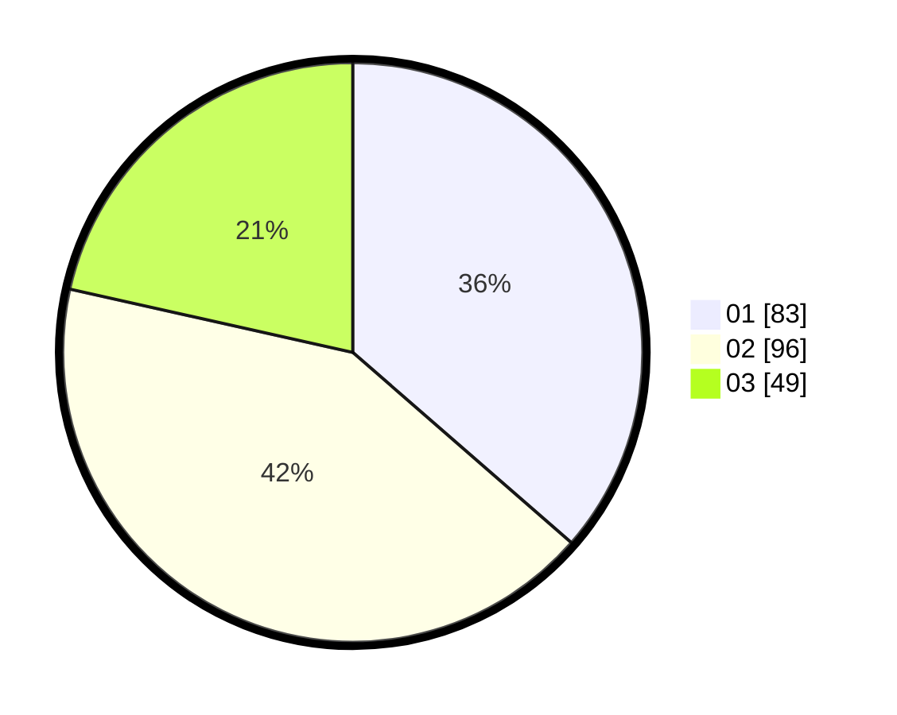

# Hasil

Hasil perolehan suara paslon dapat dilihat pada file paslon-01.txt, paslon-02.txt, dan paslon-03.txt.

Jika tidak ada, artinya data tersebut belum ada pada SIREKAP.

## Perolehan Suara

 * Paslon 01: **83**.
 * Paslon 02: **96**.
 * Paslon 03: **49**.

## Foto C Plano

https://sirekap-obj-formc.kpu.go.id/30d4/pemilu/ppwp/31/73/07/10/01/3173071001102-20240214-221013--68df004f-7e03-4436-8b4a-6075c8015aef.jpg

https://sirekap-obj-formc.kpu.go.id/30d4/pemilu/ppwp/31/73/07/10/01/3173071001102-20240214-220858--9a1e40ee-28f7-47a3-b872-02d71cbb9965.jpg

https://sirekap-obj-formc.kpu.go.id/30d4/pemilu/ppwp/31/73/07/10/01/3173071001102-20240214-220935--8b485481-2a7f-4682-b6ab-6c72c8c7f209.jpg
