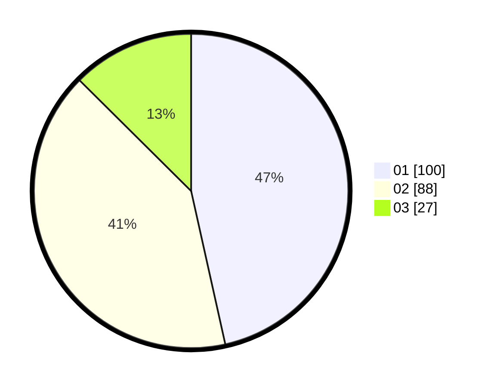

# Hasil

Hasil perolehan suara paslon dapat dilihat pada file paslon-01.txt, paslon-02.txt, dan paslon-03.txt.

Jika tidak ada, artinya data tersebut belum ada pada SIREKAP.

## Perolehan Suara

 * Paslon 01: **100**.
 * Paslon 02: **88**.
 * Paslon 03: **27**.

## Foto C Plano

https://sirekap-obj-formc.kpu.go.id/9ac9/pemilu/ppwp/31/73/07/10/01/3173071001109-20240214-194757--805fd45b-e6e6-4d66-95b0-78a2085bae35.jpg

https://sirekap-obj-formc.kpu.go.id/9ac9/pemilu/ppwp/31/73/07/10/01/3173071001109-20240214-194953--a8b8c413-0906-4ece-88fd-760910ba53aa.jpg

https://sirekap-obj-formc.kpu.go.id/9ac9/pemilu/ppwp/31/73/07/10/01/3173071001109-20240214-195155--33c83d85-25e4-4fe1-b154-223ff5c02aea.jpg

## DATA PEMILIH TETAP

Jumlah pemilih dalam DPT: **269**.
 * L: **130**.
 * P: **139**.

## DATA PENGGUNA HAK PILIH

Jumlah pengguna hak pilih dalam DPT: **216**.
 * L: **106**.
 * P: **110**.

Jumlah pengguna hak pilih dalam DPTb: **4**.
 * L: **2**.
 * P: **2**.

Jumlah pengguna hak pilih dalam DPK: **0**.
 * L: **0**.
 * P: **0**.

Jumlah pengguna hak pilih: **220**.
 * L: **108**.
 * P: **112**.

## JUMLAH SUARA SAH DAN TIDAK SAH

JUMLAH SELURUH SUARA SAH: **215**.

JUMLAH SUARA TIDAK SAH: **5**.

JUMLAH SELURUH SUARA SAH DAN SUARA TIDAK SAH: **220**.
