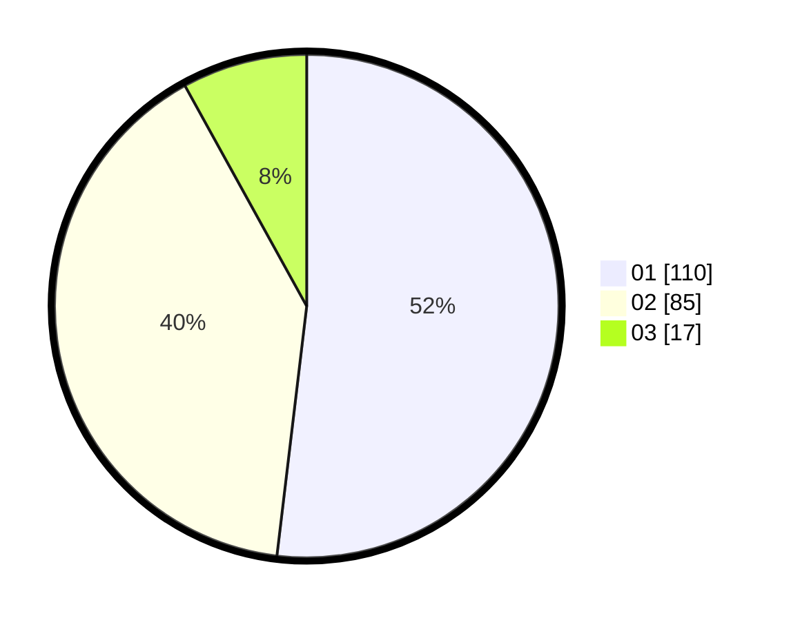

# Hasil

Hasil perolehan suara paslon dapat dilihat pada file paslon-01.txt, paslon-02.txt, dan paslon-03.txt.

Jika tidak ada, artinya data tersebut belum ada pada SIREKAP.

## Perolehan Suara

 * Paslon 01: **110**.
 * Paslon 02: **85**.
 * Paslon 03: **17**.

## Foto C Plano

https://sirekap-obj-formc.kpu.go.id/949a/pemilu/ppwp/31/73/07/10/01/3173071001111-20240214-214803--e2c706d2-cfa7-4bd7-86ac-4efd46e1d3b3.jpg

https://sirekap-obj-formc.kpu.go.id/949a/pemilu/ppwp/31/73/07/10/01/3173071001111-20240214-214846--f4a4f0cf-cf0c-4de4-b7ec-27f1e5f0eca1.jpg

https://sirekap-obj-formc.kpu.go.id/949a/pemilu/ppwp/31/73/07/10/01/3173071001111-20240214-215040--d775dc94-d1f2-4c9f-b8d0-f05dfdfd0486.jpg
