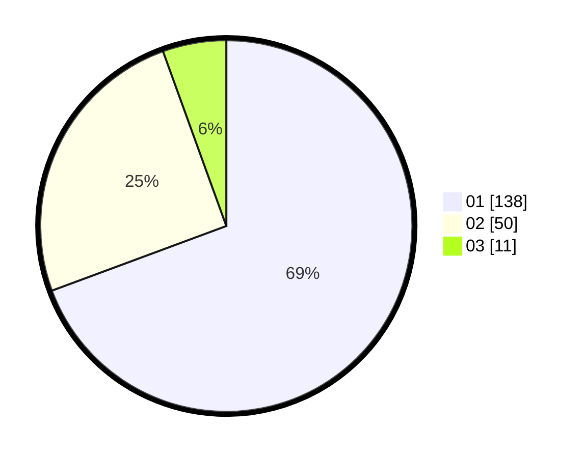

# Hasil

Hasil perolehan suara paslon dapat dilihat pada file paslon-01.txt, paslon-02.txt, dan paslon-03.txt.

Jika tidak ada, artinya data tersebut belum ada pada SIREKAP.

## Perolehan Suara

 * Paslon 01: **138**.
 * Paslon 02: **50**.
 * Paslon 03: **11**.

## Foto C Plano

https://sirekap-obj-formc.kpu.go.id/f977/pemilu/ppwp/31/73/07/10/01/3173071001117-20240214-185915--92c219e4-327a-4294-a8b2-eedb9977c7d3.jpg

https://sirekap-obj-formc.kpu.go.id/f977/pemilu/ppwp/31/73/07/10/01/3173071001117-20240214-224757--d75bc1f7-9876-490f-9b42-d5fb8c072ad2.jpg

https://sirekap-obj-formc.kpu.go.id/f977/pemilu/ppwp/31/73/07/10/01/3173071001117-20240214-190047--396ed7dd-2c42-404e-9158-4b372e38b713.jpg

## DATA PEMILIH TETAP

Jumlah pemilih dalam DPT: **266**.
 * L: **130**.
 * P: **136**.

## DATA PENGGUNA HAK PILIH

Jumlah pengguna hak pilih dalam DPT: **199**.
 * L: **95**.
 * P: **104**.

Jumlah pengguna hak pilih dalam DPTb: **0**.
 * L: **0**.
 * P: **0**.

Jumlah pengguna hak pilih dalam DPK: **4**.
 * L: **1**.
 * P: **3**.

Jumlah pengguna hak pilih: **203**.
 * L: **96**.
 * P: **107**.

## JUMLAH SUARA SAH DAN TIDAK SAH

JUMLAH SELURUH SUARA SAH: **199**.

JUMLAH SUARA TIDAK SAH: **4**.

JUMLAH SELURUH SUARA SAH DAN SUARA TIDAK SAH: **203**.
