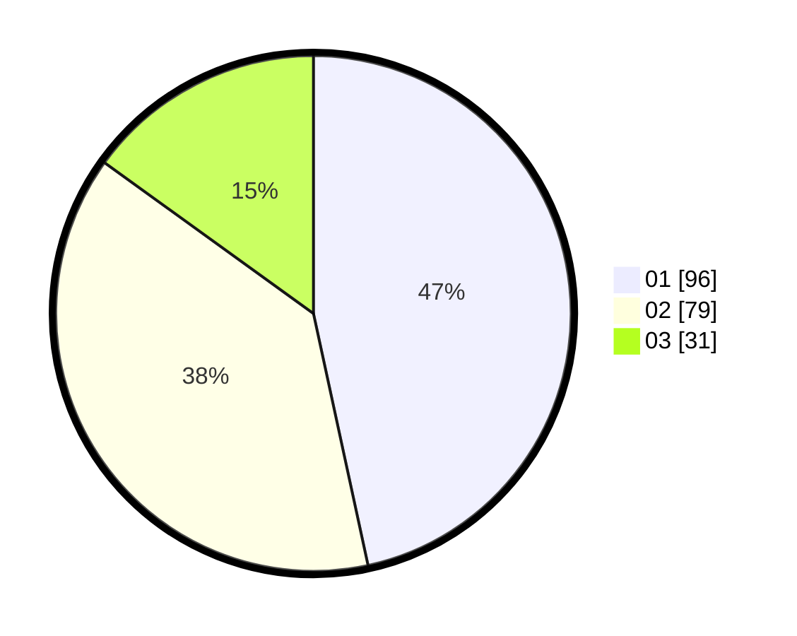

# Hasil

Hasil perolehan suara paslon dapat dilihat pada file paslon-01.txt, paslon-02.txt, dan paslon-03.txt.

Jika tidak ada, artinya data tersebut belum ada pada SIREKAP.

## Perolehan Suara

 * Paslon 01: **96**.
 * Paslon 02: **79**.
 * Paslon 03: **31**.

## Foto C Plano

https://sirekap-obj-formc.kpu.go.id/766e/pemilu/ppwp/31/73/07/10/01/3173071001119-20240214-223614--ed6c3841-ba12-4647-97c7-17b27e36fddc.jpg

https://sirekap-obj-formc.kpu.go.id/766e/pemilu/ppwp/31/73/07/10/01/3173071001119-20240214-223754--277485ff-8169-4ae5-9a16-cfb1654436fb.jpg

https://sirekap-obj-formc.kpu.go.id/766e/pemilu/ppwp/31/73/07/10/01/3173071001119-20240214-211732--0d2ee855-0a98-4457-a997-e5b03ded6126.jpg
