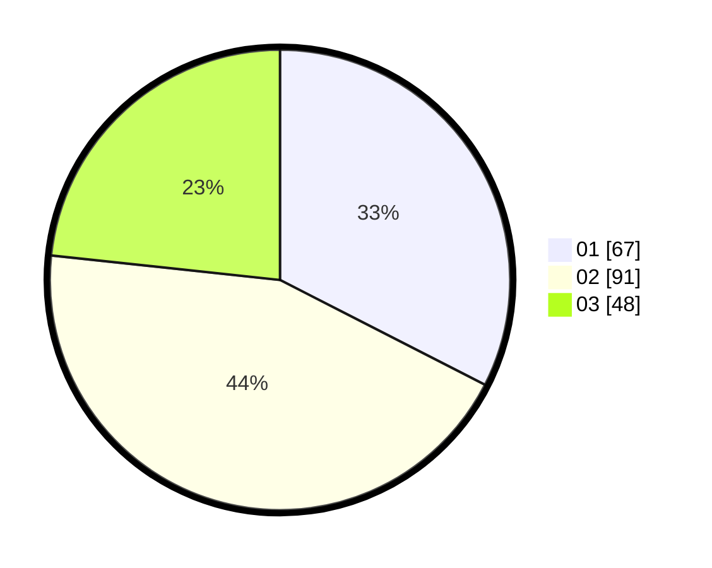

# Hasil

Hasil perolehan suara paslon dapat dilihat pada file paslon-01.txt, paslon-02.txt, dan paslon-03.txt.

Jika tidak ada, artinya data tersebut belum ada pada SIREKAP.

## Perolehan Suara

 * Paslon 01: **67**.
 * Paslon 02: **91**.
 * Paslon 03: **48**.

## Foto C Plano

https://sirekap-obj-formc.kpu.go.id/2ab6/pemilu/ppwp/31/73/07/10/01/3173071001120-20240214-235605--265e7c80-1c86-4383-8e4a-1eb0760ae3a8.jpg

https://sirekap-obj-formc.kpu.go.id/2ab6/pemilu/ppwp/31/73/07/10/01/3173071001120-20240214-235733--6a0610f3-c5bd-4a02-bc5f-6c56cbdfe76e.jpg

https://sirekap-obj-formc.kpu.go.id/2ab6/pemilu/ppwp/31/73/07/10/01/3173071001120-20240214-235809--20412dd2-29d1-4407-b56d-d05c69c4f9d2.jpg
