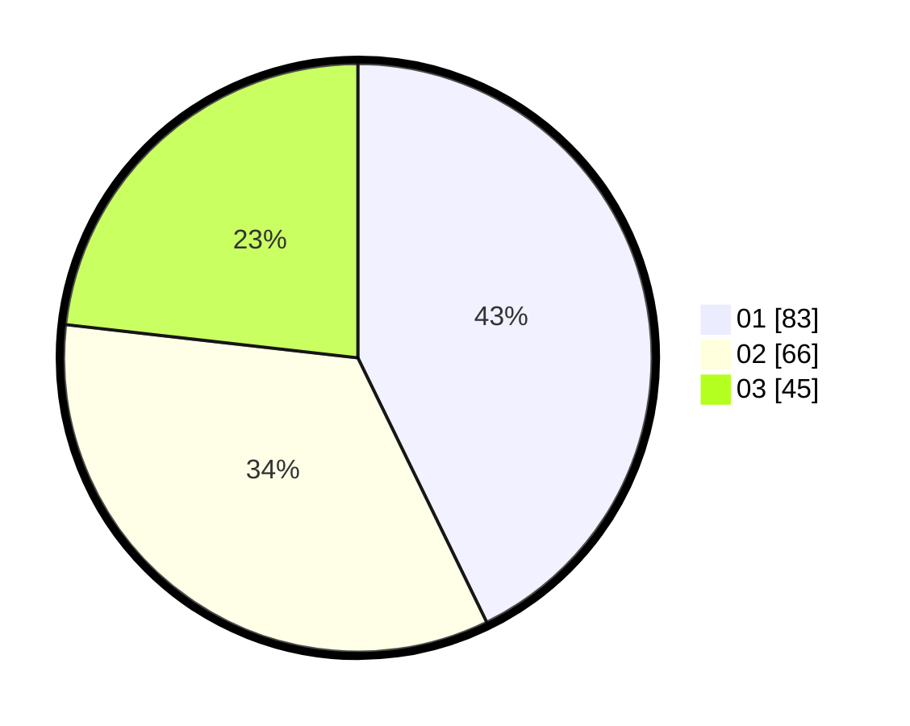

# Hasil

Hasil perolehan suara paslon dapat dilihat pada file paslon-01.txt, paslon-02.txt, dan paslon-03.txt.

Jika tidak ada, artinya data tersebut belum ada pada SIREKAP.

## Perolehan Suara

 * Paslon 01: **83**.
 * Paslon 02: **66**.
 * Paslon 03: **45**.

## Foto C Plano

https://sirekap-obj-formc.kpu.go.id/72a6/pemilu/ppwp/31/73/07/10/01/3173071001121-20240214-215912--12016ea0-9ace-457c-9c78-aef3c787d9e8.jpg

https://sirekap-obj-formc.kpu.go.id/72a6/pemilu/ppwp/31/73/07/10/01/3173071001121-20240214-220944--39055bd0-ba22-4443-8cac-d0e4c9c29e4a.jpg

https://sirekap-obj-formc.kpu.go.id/72a6/pemilu/ppwp/31/73/07/10/01/3173071001121-20240214-221141--506ae262-7f1c-4383-a3cf-8024f7dc48ac.jpg
