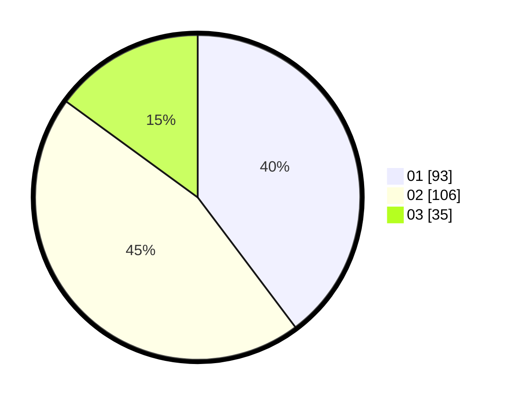

# Hasil

Hasil perolehan suara paslon dapat dilihat pada file paslon-01.txt, paslon-02.txt, dan paslon-03.txt.

Jika tidak ada, artinya data tersebut belum ada pada SIREKAP.

## Perolehan Suara

 * Paslon 01: **93**.
 * Paslon 02: **106**.
 * Paslon 03: **35**.

## Foto C Plano

https://sirekap-obj-formc.kpu.go.id/e0f5/pemilu/ppwp/31/73/07/10/01/3173071001123-20240214-213624--cfab9865-61c9-4614-a416-75be0b8648ca.jpg

https://sirekap-obj-formc.kpu.go.id/e0f5/pemilu/ppwp/31/73/07/10/01/3173071001123-20240214-213857--af0190c3-cc4e-47af-9262-6b610ba462b0.jpg
