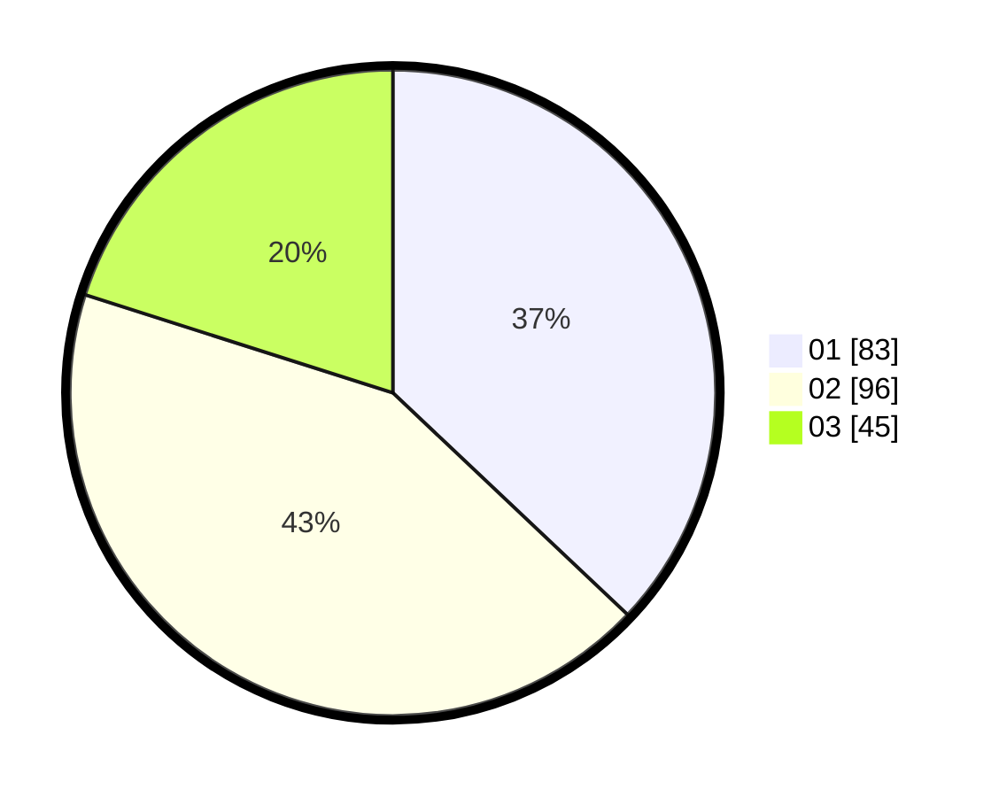

# Hasil

Hasil perolehan suara paslon dapat dilihat pada file paslon-01.txt, paslon-02.txt, dan paslon-03.txt.

Jika tidak ada, artinya data tersebut belum ada pada SIREKAP.

## Perolehan Suara

 * Paslon 01: **83**.
 * Paslon 02: **96**.
 * Paslon 03: **45**.

## Foto C Plano

https://sirekap-obj-formc.kpu.go.id/d99a/pemilu/ppwp/31/73/07/10/01/3173071001124-20240214-211934--be6610c6-5d13-4aa8-8433-f065b5b280af.jpg

https://sirekap-obj-formc.kpu.go.id/d99a/pemilu/ppwp/31/73/07/10/01/3173071001124-20240214-212051--f8035f7b-e903-4aef-9a83-57506473903d.jpg

https://sirekap-obj-formc.kpu.go.id/d99a/pemilu/ppwp/31/73/07/10/01/3173071001124-20240214-212152--b03e450f-4758-4254-ae01-d5e19f26133f.jpg
