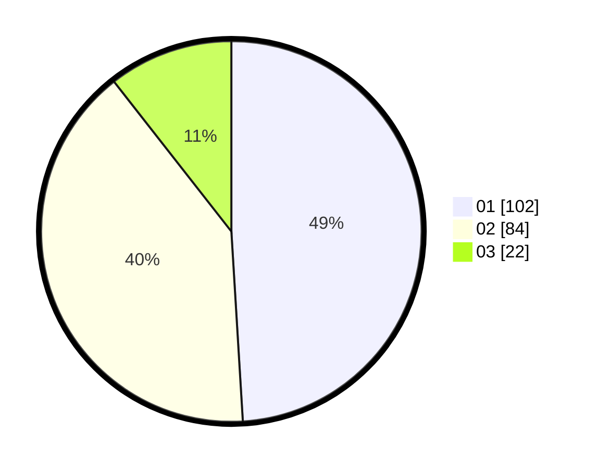

# Hasil

Hasil perolehan suara paslon dapat dilihat pada file paslon-01.txt, paslon-02.txt, dan paslon-03.txt.

Jika tidak ada, artinya data tersebut belum ada pada SIREKAP.

## Perolehan Suara

 * Paslon 01: **102**.
 * Paslon 02: **84**.
 * Paslon 03: **22**.

## Foto C Plano

https://sirekap-obj-formc.kpu.go.id/8d8e/pemilu/ppwp/31/73/07/10/01/3173071001128-20240214-212152--0a7be7e8-3d51-45b8-afe5-454379bf4a26.jpg

https://sirekap-obj-formc.kpu.go.id/8d8e/pemilu/ppwp/31/73/07/10/01/3173071001128-20240214-212310--d8395a28-38a8-4ca0-bbb5-e03265dabd44.jpg

https://sirekap-obj-formc.kpu.go.id/8d8e/pemilu/ppwp/31/73/07/10/01/3173071001128-20240214-212409--23abe465-fd4c-495a-9b21-b7196c53489a.jpg
