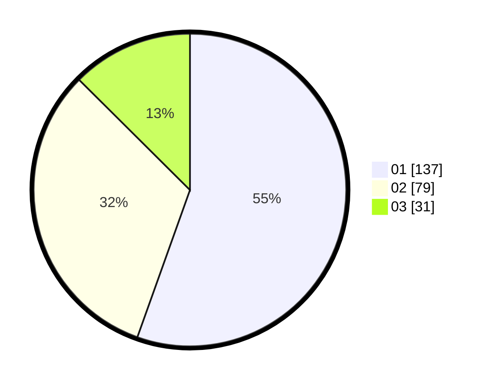

# Hasil

Hasil perolehan suara paslon dapat dilihat pada file paslon-01.txt, paslon-02.txt, dan paslon-03.txt.

Jika tidak ada, artinya data tersebut belum ada pada SIREKAP.

## Perolehan Suara

 * Paslon 01: **137**.
 * Paslon 02: **79**.
 * Paslon 03: **31**.

## Foto C Plano

https://sirekap-obj-formc.kpu.go.id/d706/pemilu/ppwp/31/73/07/10/01/3173071001135-20240215-005648--4273eb3e-4f28-4153-a91b-641d9c062a6e.jpg

https://sirekap-obj-formc.kpu.go.id/d706/pemilu/ppwp/31/73/07/10/01/3173071001135-20240215-005840--5ef32093-11b4-42ed-b09a-25f2f23c8539.jpg

https://sirekap-obj-formc.kpu.go.id/d706/pemilu/ppwp/31/73/07/10/01/3173071001135-20240215-010014--551561e8-014d-452b-8dbe-11f9f0ea707e.jpg
