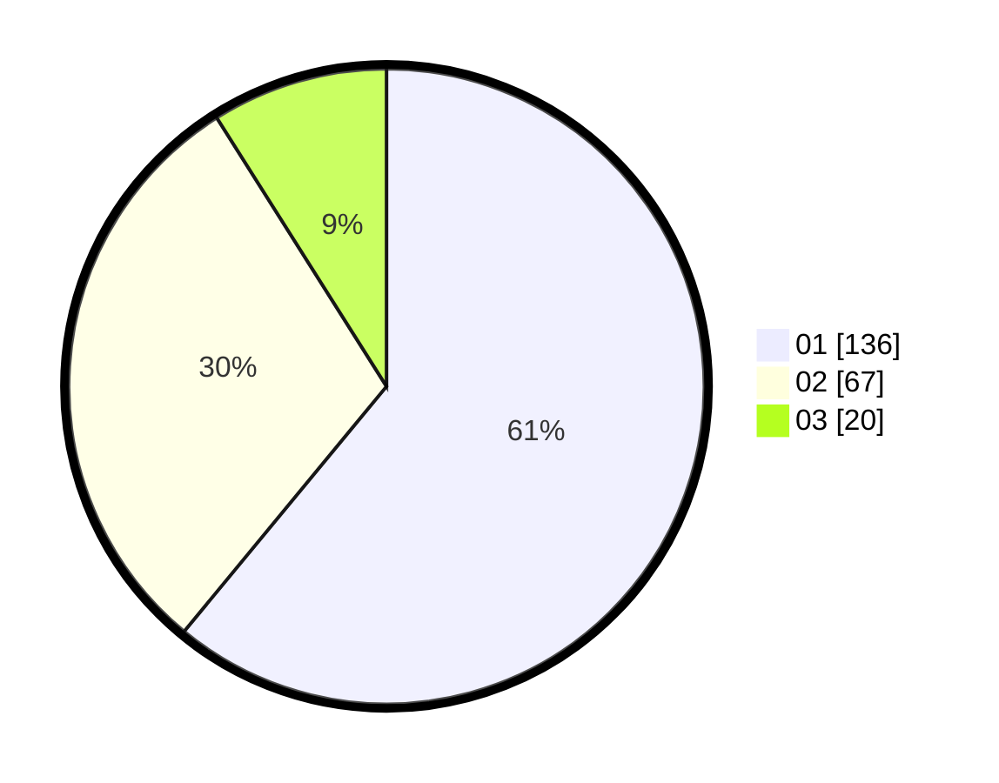

# Hasil

Hasil perolehan suara paslon dapat dilihat pada file paslon-01.txt, paslon-02.txt, dan paslon-03.txt.

Jika tidak ada, artinya data tersebut belum ada pada SIREKAP.

## Perolehan Suara

 * Paslon 01: **136**.
 * Paslon 02: **67**.
 * Paslon 03: **20**.

## Foto C Plano

https://sirekap-obj-formc.kpu.go.id/5240/pemilu/ppwp/31/73/07/10/01/3173071001138-20240214-221123--247f0d9f-b98d-4d8e-9894-afba26a80b17.jpg

https://sirekap-obj-formc.kpu.go.id/5240/pemilu/ppwp/31/73/07/10/01/3173071001138-20240214-221218--46230b87-1657-48f3-b583-13815c5bb180.jpg

https://sirekap-obj-formc.kpu.go.id/5240/pemilu/ppwp/31/73/07/10/01/3173071001138-20240214-221303--f1f797fd-cb37-4f5c-8b7f-7f0d9e8ae2b2.jpg
