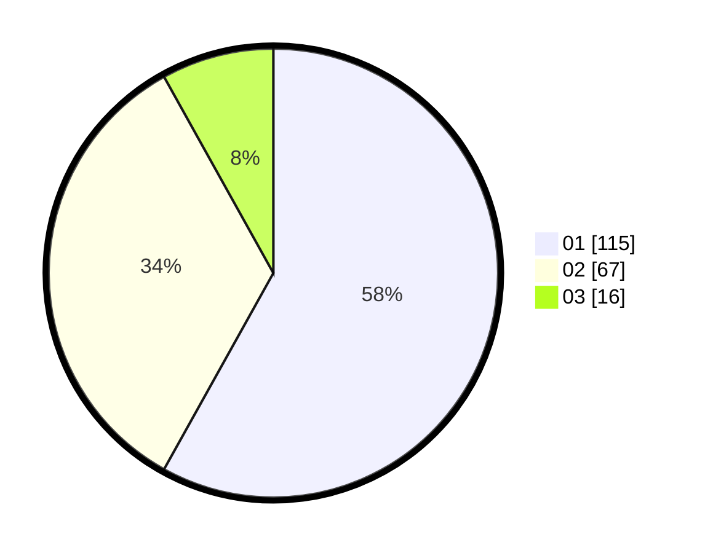

# Hasil

Hasil perolehan suara paslon dapat dilihat pada file paslon-01.txt, paslon-02.txt, dan paslon-03.txt.

Jika tidak ada, artinya data tersebut belum ada pada SIREKAP.

## Perolehan Suara

 * Paslon 01: **115**.
 * Paslon 02: **67**.
 * Paslon 03: **16**.

## Foto C Plano

https://sirekap-obj-formc.kpu.go.id/29cb/pemilu/ppwp/31/73/07/10/01/3173071001144-20240215-022807--00877b2b-cebd-4310-bb9c-79d550238ef0.jpg

https://sirekap-obj-formc.kpu.go.id/29cb/pemilu/ppwp/31/73/07/10/01/3173071001144-20240214-235123--cad55e35-8576-48fc-91a1-417011387386.jpg

https://sirekap-obj-formc.kpu.go.id/29cb/pemilu/ppwp/31/73/07/10/01/3173071001144-20240214-235240--4d443345-b7cf-47e8-8a7a-b647aba84158.jpg
