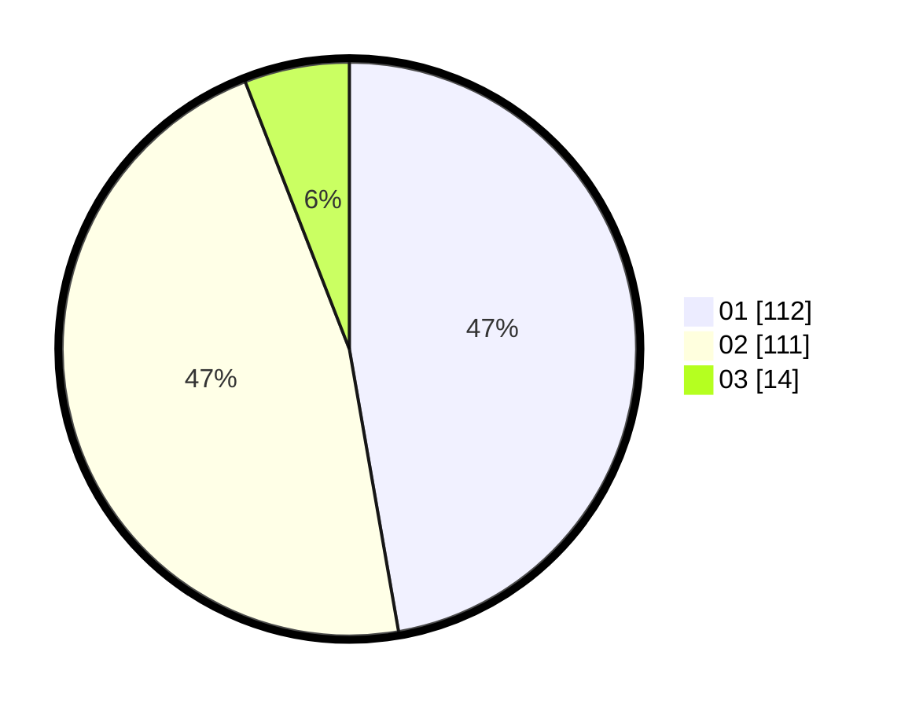

# Hasil

Hasil perolehan suara paslon dapat dilihat pada file paslon-01.txt, paslon-02.txt, dan paslon-03.txt.

Jika tidak ada, artinya data tersebut belum ada pada SIREKAP.

## Perolehan Suara

 * Paslon 01: **112**.
 * Paslon 02: **111**.
 * Paslon 03: **14**.

## Foto C Plano

https://sirekap-obj-formc.kpu.go.id/461d/pemilu/ppwp/31/73/07/10/01/3173071001145-20240215-020209--065ff446-fb6d-4cf3-b93c-4c626629dc37.jpg

https://sirekap-obj-formc.kpu.go.id/461d/pemilu/ppwp/31/73/07/10/01/3173071001145-20240215-020328--ab243fc8-feaf-44ba-bef1-839a04978d82.jpg

https://sirekap-obj-formc.kpu.go.id/461d/pemilu/ppwp/31/73/07/10/01/3173071001145-20240215-020421--1c8ba67b-ee79-4893-b5c5-a3a941911c7a.jpg
