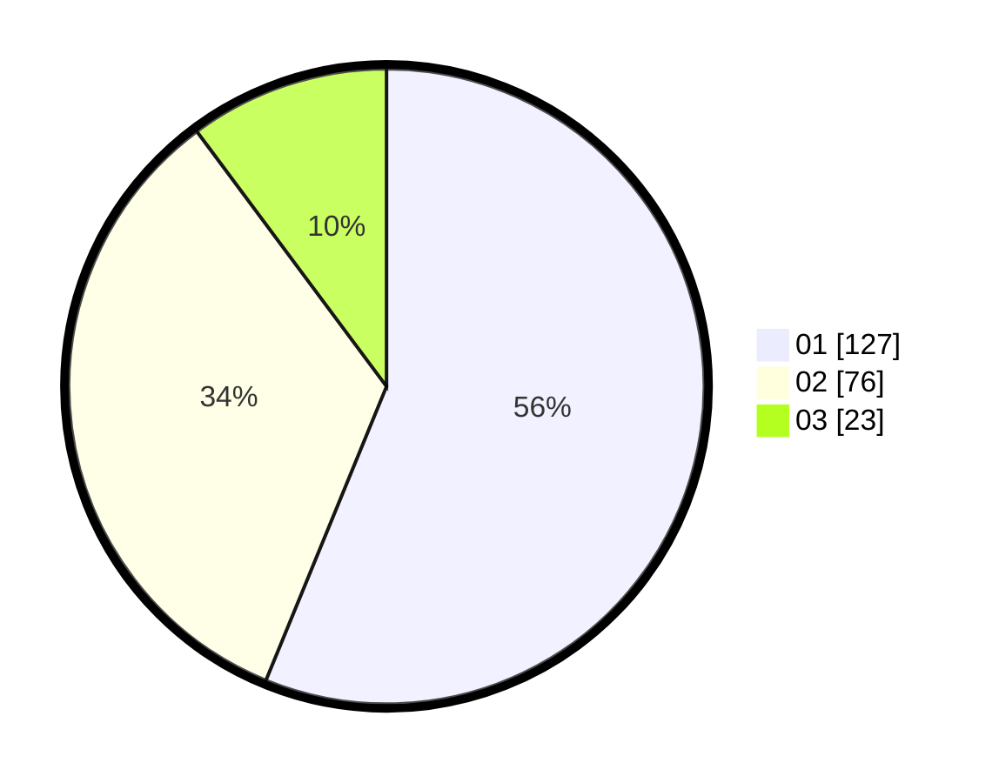

# Hasil

Hasil perolehan suara paslon dapat dilihat pada file paslon-01.txt, paslon-02.txt, dan paslon-03.txt.

Jika tidak ada, artinya data tersebut belum ada pada SIREKAP.

## Perolehan Suara

 * Paslon 01: **127**.
 * Paslon 02: **76**.
 * Paslon 03: **23**.

## Foto C Plano

https://sirekap-obj-formc.kpu.go.id/db13/pemilu/ppwp/31/73/07/10/01/3173071001146-20240214-225742--2b96f37e-3a61-48bc-9ebc-1bef4d64dbdd.jpg

https://sirekap-obj-formc.kpu.go.id/db13/pemilu/ppwp/31/73/07/10/01/3173071001146-20240214-225923--f23247ff-5230-4e7d-9026-e253f6ec5823.jpg

https://sirekap-obj-formc.kpu.go.id/db13/pemilu/ppwp/31/73/07/10/01/3173071001146-20240214-230133--240e8157-efb7-4568-a355-ffc5f8e8d2b4.jpg
