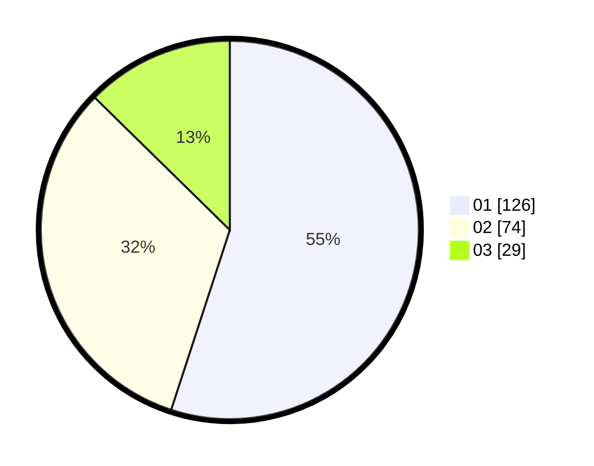

# Hasil

Hasil perolehan suara paslon dapat dilihat pada file paslon-01.txt, paslon-02.txt, dan paslon-03.txt.

Jika tidak ada, artinya data tersebut belum ada pada SIREKAP.

## Perolehan Suara

 * Paslon 01: **126**.
 * Paslon 02: **74**.
 * Paslon 03: **29**.

## Foto C Plano

https://sirekap-obj-formc.kpu.go.id/b94c/pemilu/ppwp/31/73/07/10/01/3173071001150-20240214-210322--757794d7-3e34-4524-9642-cbd351369755.jpg

https://sirekap-obj-formc.kpu.go.id/b94c/pemilu/ppwp/31/73/07/10/01/3173071001150-20240214-210423--9ad36d6f-0a8e-4fef-9154-e42ed1f5b1bd.jpg

https://sirekap-obj-formc.kpu.go.id/b94c/pemilu/ppwp/31/73/07/10/01/3173071001150-20240214-221041--5a65b93f-4f05-4567-8daf-e2bab6c72a28.jpg
