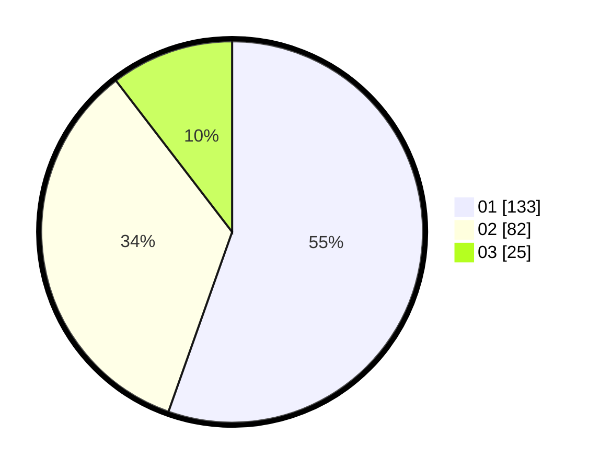

# Hasil

Hasil perolehan suara paslon dapat dilihat pada file paslon-01.txt, paslon-02.txt, dan paslon-03.txt.

Jika tidak ada, artinya data tersebut belum ada pada SIREKAP.

## Perolehan Suara

 * Paslon 01: **133**.
 * Paslon 02: **82**.
 * Paslon 03: **25**.

## Foto C Plano

https://sirekap-obj-formc.kpu.go.id/4851/pemilu/ppwp/31/73/07/10/01/3173071001151-20240214-212947--bba0102b-0ffc-4510-a171-8784ff48b116.jpg

https://sirekap-obj-formc.kpu.go.id/4851/pemilu/ppwp/31/73/07/10/01/3173071001151-20240214-213024--70ce6b79-3f24-425b-818d-0298de8cf7b2.jpg

https://sirekap-obj-formc.kpu.go.id/4851/pemilu/ppwp/31/73/07/10/01/3173071001151-20240214-213049--f264dbda-a4ad-4ce4-ba90-cc2a07e73d4d.jpg

## DATA PEMILIH TETAP

Jumlah pemilih dalam DPT: **273**.
 * L: **143**.
 * P: **130**.

## DATA PENGGUNA HAK PILIH

Jumlah pengguna hak pilih dalam DPT: **228**.
 * L: **118**.
 * P: **110**.

Jumlah pengguna hak pilih dalam DPTb: **12**.
 * L: **3**.
 * P: **9**.

Jumlah pengguna hak pilih dalam DPK: **2**.
 * L: **0**.
 * P: **2**.

Jumlah pengguna hak pilih: **242**.
 * L: **121**.
 * P: **121**.

## JUMLAH SUARA SAH DAN TIDAK SAH

JUMLAH SELURUH SUARA SAH: **240**.

JUMLAH SUARA TIDAK SAH: **2**.

JUMLAH SELURUH SUARA SAH DAN SUARA TIDAK SAH: **242**.
