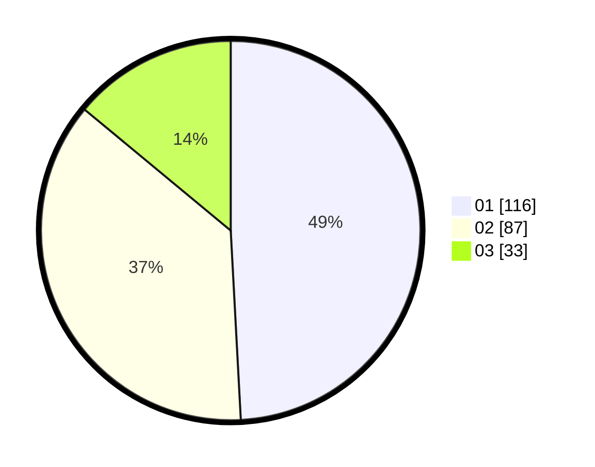

# Hasil

Hasil perolehan suara paslon dapat dilihat pada file paslon-01.txt, paslon-02.txt, dan paslon-03.txt.

Jika tidak ada, artinya data tersebut belum ada pada SIREKAP.

## Perolehan Suara

 * Paslon 01: **116**.
 * Paslon 02: **87**.
 * Paslon 03: **33**.

## Foto C Plano

https://sirekap-obj-formc.kpu.go.id/5e76/pemilu/ppwp/31/73/07/10/01/3173071001154-20240214-225659--5abdd801-ce6c-4371-b4eb-896d0be22ad7.jpg

https://sirekap-obj-formc.kpu.go.id/5e76/pemilu/ppwp/31/73/07/10/01/3173071001154-20240214-225742--69d605a8-36df-4db2-8262-35b63eb45918.jpg

https://sirekap-obj-formc.kpu.go.id/5e76/pemilu/ppwp/31/73/07/10/01/3173071001154-20240215-001740--328fbdd9-5dfc-4305-933f-fa15258e100a.jpg
