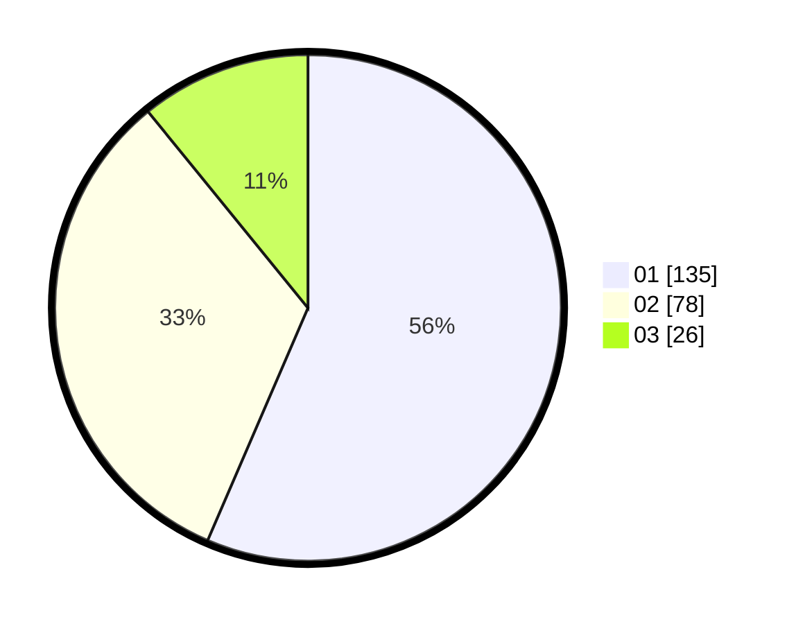

# Hasil

Hasil perolehan suara paslon dapat dilihat pada file paslon-01.txt, paslon-02.txt, dan paslon-03.txt.

Jika tidak ada, artinya data tersebut belum ada pada SIREKAP.

## Perolehan Suara

 * Paslon 01: **135**.
 * Paslon 02: **78**.
 * Paslon 03: **26**.

## Foto C Plano

https://sirekap-obj-formc.kpu.go.id/1ece/pemilu/ppwp/31/73/07/10/01/3173071001158-20240214-231650--06bfb842-849d-49e3-9e6b-db1f8f795b59.jpg

https://sirekap-obj-formc.kpu.go.id/1ece/pemilu/ppwp/31/73/07/10/01/3173071001158-20240214-231754--7b43781a-706b-4f33-8a8b-863567d9ec6c.jpg

https://sirekap-obj-formc.kpu.go.id/1ece/pemilu/ppwp/31/73/07/10/01/3173071001158-20240215-023943--52b4cf10-4d10-4893-8bbc-70704d45bf79.jpg

## DATA PEMILIH TETAP

Jumlah pemilih dalam DPT: **278**.
 * L: **128**.
 * P: **150**.

## DATA PENGGUNA HAK PILIH

Jumlah pengguna hak pilih dalam DPT: **228**.
 * L: **104**.
 * P: **124**.

Jumlah pengguna hak pilih dalam DPTb: **12**.
 * L: **6**.
 * P: **6**.

Jumlah pengguna hak pilih dalam DPK: **3**.
 * L: **2**.
 * P: **1**.

Jumlah pengguna hak pilih: **243**.
 * L: **112**.
 * P: **131**.

## JUMLAH SUARA SAH DAN TIDAK SAH

JUMLAH SELURUH SUARA SAH: **239**.

JUMLAH SUARA TIDAK SAH: **4**.

JUMLAH SELURUH SUARA SAH DAN SUARA TIDAK SAH: **243**.
