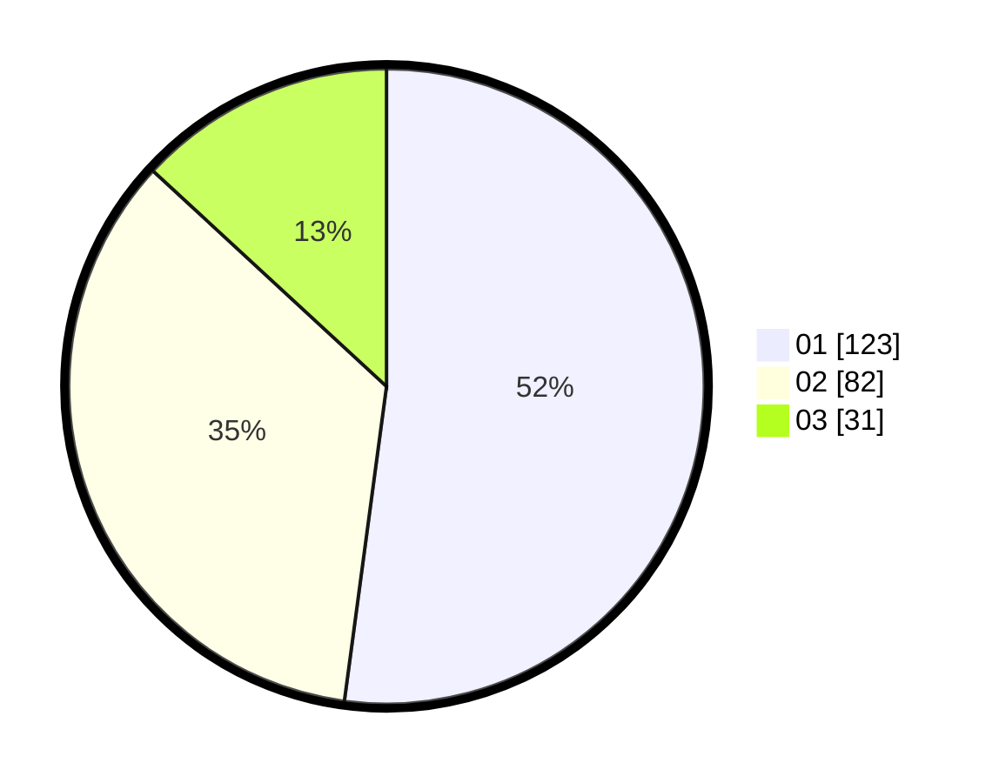

# Hasil

Hasil perolehan suara paslon dapat dilihat pada file paslon-01.txt, paslon-02.txt, dan paslon-03.txt.

Jika tidak ada, artinya data tersebut belum ada pada SIREKAP.

## Perolehan Suara

 * Paslon 01: **123**.
 * Paslon 02: **82**.
 * Paslon 03: **31**.

## Foto C Plano

https://sirekap-obj-formc.kpu.go.id/6bb8/pemilu/ppwp/31/73/07/10/01/3173071001161-20240215-021645--f0057873-5d9d-468c-b7bc-4d2fca62c636.jpg

https://sirekap-obj-formc.kpu.go.id/6bb8/pemilu/ppwp/31/73/07/10/01/3173071001161-20240215-021804--0f9a52a0-c501-44f3-b580-a62107a62477.jpg

https://sirekap-obj-formc.kpu.go.id/6bb8/pemilu/ppwp/31/73/07/10/01/3173071001161-20240215-021834--cc0c0304-5b5c-4079-9f30-e45312fa9120.jpg
