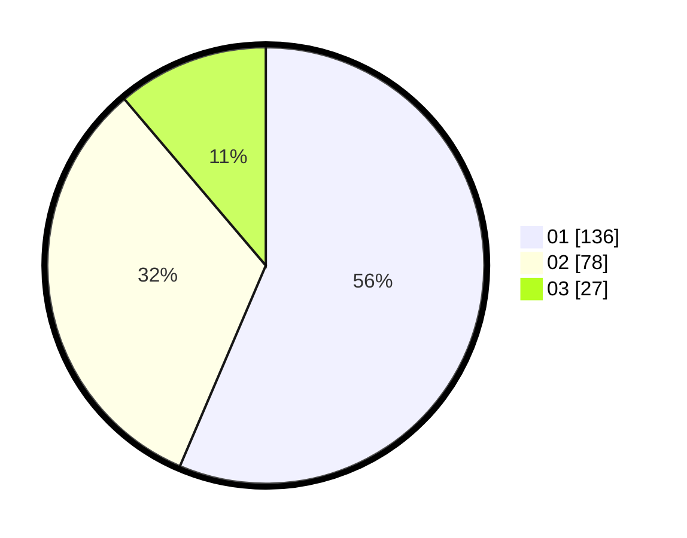

# Hasil

Hasil perolehan suara paslon dapat dilihat pada file paslon-01.txt, paslon-02.txt, dan paslon-03.txt.

Jika tidak ada, artinya data tersebut belum ada pada SIREKAP.

## Perolehan Suara

 * Paslon 01: **136**.
 * Paslon 02: **78**.
 * Paslon 03: **27**.

## Foto C Plano

https://sirekap-obj-formc.kpu.go.id/9c28/pemilu/ppwp/31/73/07/10/01/3173071001166-20240215-001602--62f81a61-289a-47bb-a699-9bcde71edba6.jpg

https://sirekap-obj-formc.kpu.go.id/9c28/pemilu/ppwp/31/73/07/10/01/3173071001166-20240215-001647--9520d9a0-1091-4afe-ac92-e4356d9c0df8.jpg

https://sirekap-obj-formc.kpu.go.id/9c28/pemilu/ppwp/31/73/07/10/01/3173071001166-20240215-001842--b11cad30-db01-49fd-924c-3c7310ff52a2.jpg
