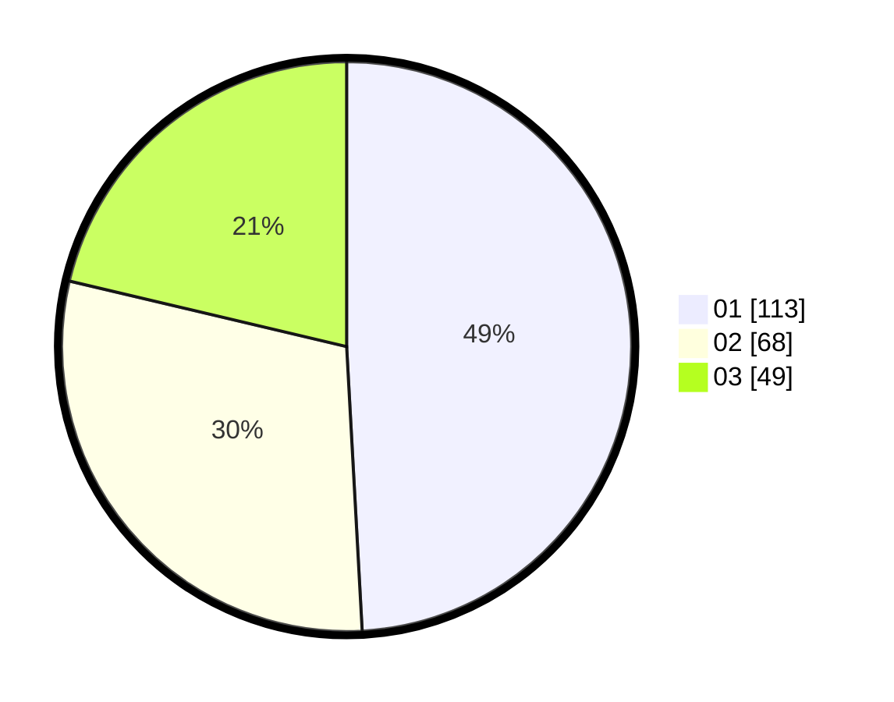

# Hasil

Hasil perolehan suara paslon dapat dilihat pada file paslon-01.txt, paslon-02.txt, dan paslon-03.txt.

Jika tidak ada, artinya data tersebut belum ada pada SIREKAP.

## Perolehan Suara

 * Paslon 01: **113**.
 * Paslon 02: **68**.
 * Paslon 03: **49**.

## Foto C Plano

https://sirekap-obj-formc.kpu.go.id/020d/pemilu/ppwp/31/73/07/10/01/3173071001168-20240215-043242--15355df5-cbcb-4da5-9e75-37bf78004cf9.jpg

https://sirekap-obj-formc.kpu.go.id/020d/pemilu/ppwp/31/73/07/10/01/3173071001168-20240215-014811--e5c4771b-5a4d-43fd-8bff-5af4d9756785.jpg

https://sirekap-obj-formc.kpu.go.id/020d/pemilu/ppwp/31/73/07/10/01/3173071001168-20240215-014852--0abcc636-8f8d-4b94-9be2-deb633aa1dc8.jpg
