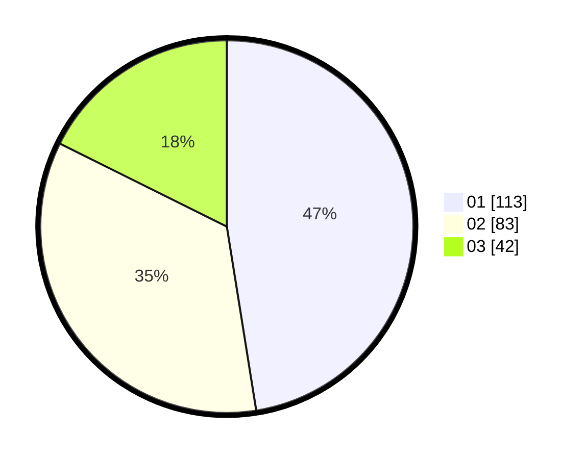

# Hasil

Hasil perolehan suara paslon dapat dilihat pada file paslon-01.txt, paslon-02.txt, dan paslon-03.txt.

Jika tidak ada, artinya data tersebut belum ada pada SIREKAP.

## Perolehan Suara

 * Paslon 01: **113**.
 * Paslon 02: **83**.
 * Paslon 03: **42**.

## Foto C Plano

https://sirekap-obj-formc.kpu.go.id/2151/pemilu/ppwp/31/73/07/10/01/3173071001172-20240214-220727--1ebcdc47-b02c-4ec2-907f-88a0c3d89da4.jpg

https://sirekap-obj-formc.kpu.go.id/2151/pemilu/ppwp/31/73/07/10/01/3173071001172-20240214-220309--b49d99cc-7193-4356-aa8c-656cf53d1900.jpg

https://sirekap-obj-formc.kpu.go.id/2151/pemilu/ppwp/31/73/07/10/01/3173071001172-20240214-220431--409baf7e-f3f5-4b88-8a6c-f8af182a6205.jpg
